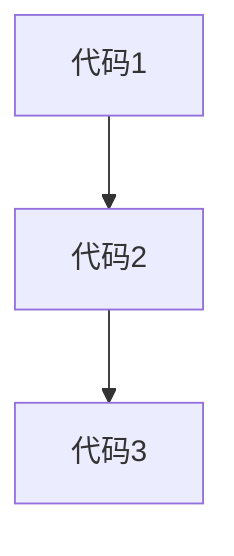
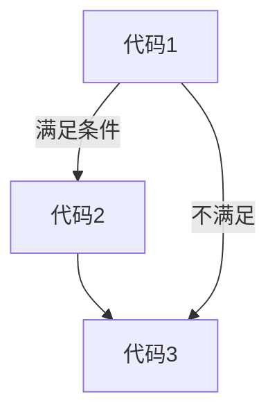
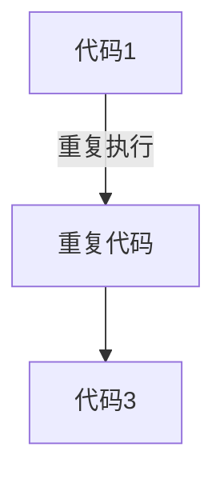

# 变量(<font style="color:red">重要</font>):dagger: 

## 变量是什么:question: 

理解变量是计算机存储数据的<font style="color:red">"容器"</font>。:small_red_triangle: 

### 1.变量:clamp: 

-  白话：变量就是一个装东西的盒子。:clipboard: 
-  通俗：变量是计算机中用来**存储数据**的<font style="color:red">"容器"</font>,它可以让计算机变得有记忆。
-  注意：:warning::<font style="color:red">变量不是数据本身，它们仅仅是一个用于存储数值的容器，可以理解为是一个个用来装东西的纸箱子</font>。

## 变量基本使用:star: 

### 1.声明变量:statue_of_liberty: 

要想使用变量，首先需要创建变量（也称为声明变量或者定义变量）

**语法**：:game_die: 

```js
let 变量名
```

-  声明变量由两部分构成：声明关键字，变量名（标识）
-  let 即关键字（let :  允许，许可，让，要），所谓关键字是系统提供的专门用来声明（定义）变量的词语
-  <u>var是我们的前任请把var忘掉</u>   ---  [pink老师]

**举例**：:chestnut: 

```js
<script>
    let name;
</script>
```

-  我们声明了一个 name 变量
-  name 即<font style="color:red">**变量的名称**</font>,也叫标识符 :small_red_triangle: 

### 2.变量赋值:moyai: 

定义了一个变量后，你就能够初始化它（赋值），在变量名之后跟上一个 " = "(赋值运算符) , 然后是数值。

声明变量的时候直接完成赋值操作，这种操作也成为，变量<font style="color:red">初始化</font>。

```js
<script>
    //声明一个变量名为name,并赋值
    let name = 'DouKx';
    //弹出变量的值
    alert(name);
</script>
```

:warning:**注意**：是通过<font style="color:red">变量名</font>来获得变量里面的数据。


:star2:**目标**：掌握变量的更新以及了解同时声明多个变量的写法。

### 声明多个变量:star: 

:video_game:**语法**:  多个变量中间用==逗号隔开==。

:clipboard:**说明**:  看上去代码长度更短,但并<font style="color:red">**不推荐**</font>这样,为了更好的可读性,请一行只声明一个变量

```js
<script>
let name = '张三';
//变量的更新
name = '李四';
alert(name);
//将name1和name2都赋值为 刘桑
let name1 = name2 = '刘桑';
alert(name1);
alert(name2);
let a = b = 1;//1+1 = 2
alert(a+b);
//同时声明多个变量并且它们赋值也是不同的
let name = '张三' , name1 = '刘桑';
alert(name);
alert(name1);
//同时声明多个变量并且后续进行赋值
let a,b;
a = '张三';
b = '李四';
console.log(a,b);//结果 张三 李四
</script>
```

### 3.更新变量:statue_of_liberty: 

变量赋值后，还可以通过简单的给它一个不同的值来更新它。

```js
<script>
//声明了一个name变量,同时里面存放了'张三'这个数据
let name = '张三';
//这里不允许多次声明一个变量,没有理由重新声明变量
let name = '李四';
alert(name);
</script>
```


:warning:<font style="color:red">**注意**</font>：let 不允许多次声明同一个变量

## 变量的本质:earth_africa: 

:avocado:**内存**：计算机中存储数据的地方，相当于一个空间

:sailboat:**变量本质**：是程序在内存中申请的一块用来存放数据的小空间, js的变量是存储到内存中的


-  在内存中开辟一个空间
-  通过变量名找到值

## 变量命名规则与规范:gem: 

:globe_with_meridians:**规则**：必须遵守，不遵守报错（法律层面）

:globe_with_meridians:**规范**：建议，不遵守不会报错，但不符合业内通识（道德层面）

:globe_with_meridians:**规则1**:

-  不能用关键字:warning: 
   -  关键字:有特殊含义的符号,JavaScript内置的一些英语词汇,例如:let , var , if , for等
-  只能用下划线,字母,数字,$组成,且数字不能开头
-  字母严格<font style="color:red">**区分大小写**</font>,如Age和age是不同的变量

:globe_with_meridians:**规则2**:

-  起名要有意义
-  遵守驼峰命名法
   -  第一个单词首字母小写,后面每个单词首字母大写,例如:userName


##  变量扩展-let和var的区别:first_quarter_moon: 

**let和var区别**: 

在较旧的JavaScript,使用关键字var来声明变量,而不是let

var现在开发中一般不再使用它,只是我们可能再老版程序中看到它.

**let为了解决var的一些问题** 

**var声明**::dart: 

-  可以先使用,在声明(不合理)
-  var声明过的变量可以重复声明(不合理)
-  比如变量提升,全局变量,没有块级作用域等等

**结论**:

<font style="color:red">var就是个bug,以后声明变量统一使用let</font> .:ticket: 

# 数组:dagger: 

-  数组(Array) --- 一种将**一组数据存储在单个变量名下**的优雅方式

声明方式:

```js
let arr = [];
     ↓    ↓
    变量  数组字面量
+----------------------------------+
//赋值方式,每个数据之间用逗号隔开
let 数组名 = [数据1,数据2,...,数据n];
```

-  数组是按顺序保存的,所以每个数据都有自己的编号
-  计算机中的编号从0开始,所以数据1的编号为0,数据2的编号为1,以此类推
-  在数组中,数据的编号也叫<font style="color:red">**索引**或**下标**</font>.
-  <font style="color:red">JavaScript中数组可以存储任意类型的数据</font>.:warning: 
-  取出来是什么类型的,就根据这种类型特点来访问
-  最大索引号+1等于数组长度:dizzy: 

取值语法::game_die: 

```js
数组名[下标]
```

例如:cherry_blossom: 

```js
<script>
   let arr = ['张三','李四',20];
console.log('arr[2]数据类型:'+typeof arr[2]);
console.log('arr[1]数据类型:'+typeof arr[1]);
console.log('arr[0]下标值:'+arr[0]);
</script> 
```


**一些术语**::checkered_flag: 

-  元素:数组中保存的每个数据都叫数组元素
-  下标/索引:数组中数据的编号
-  长度:数组中数据的个数,通过数组的length属性获得 (最大索引号+1等于数组长度)

# 常量:field_hockey: 

:green_book: **概念**:使用const声明的变量为 "常量".

**使用场景**:当某个变量永远**不会改变**的时候,就可以使用const来声明,而不是let

**命名规范**:变量名统一大写:green_book: 

```js
//声明一个常量
const NAME = '刘桑';
//输出常量值
console.log(NAME);
```

**注意**::warning:<font style="color:red">常量不允许重新赋值,声明的时候必须赋值(初始化)</font>.

**尝试改变常量值的后果** :red_circle: 

```js
<script>
   const NAME = '刘桑';
   console.log(NAME);
   NAME = '张三';
   console.log(NAME);
</script>
```


:diamond_shape_with_a_dot_inside: 

-  let  -  现在实际开发变量声明方式.
-  var  -  以前的声明变量的方式,会有很多问题
-  const  -  类似于let,但是变量的值无法被修改

# 数据类型:star: 

计算机世界中的万事万物都是数据

计算机程序可以处理大量的数据,为什么要给数据分类?

-  1.更加充分和高效的利用内存
-  2.更加方便程序员的使用数据

## JS数据类型整体分为两大类:tanabata_tree: 

-  基本数据类型:star2: 
-  引用数据类型:star2: 


## 数字类型 Number:nut_and_bolt: 

:diamond_shape_with_a_dot_inside: 

即我们数学中学习到的数字,可以是整数,小数,正数,负数

JavaScript中的正数,负数,小数等 统一称为 数字类型.

```js
<script>
   //number数据类型
   let number = 1;
   let number1 = 1.1;
   console.log('number:'+number);
   console.log('number1:'+number1);
</script>
```


<font  style="color:red">注意事项</font>::warning: 

>  <font style="color:red">JS是弱数据类型,变量到底属于那种类型,只有赋值之后,我们才能确认</font>.
>
>  <font style="color:red">Java是强数据类型,例如: int a = 3 必须是整数类型</font>.

数字可以有很多种操作,比如: 乘法 `*` , 除法 `/` , 加法 `+` , 减法 `-` . 等等,所以经常和算术运算符一起.

数学运算符也叫**算术运算符**,主要包括 加 , 减 , 乘 , 除 , 取余 (求模).

-  `+`:求和
-  `-`:求差
-  `*`:求积
-  `/`:求商
-  `%`:取模(取余数)
   -  开发中经常作为某个数字是否被整除

:star2:取模计算技巧：前面的数比后面的数大结果就是后面的数，比如：3 % 4 = 3

```js
<script>
   console.log(1 + 1);//2
   console.log(1 - 1);//0
   console.log(1 * 1);//1
   console.log(1 / 1);//1
   console.log(4 % 2);//0
   console.log(2 % 4);//2
   console.log(1 % 4);//1
   console.log(3 % 4);//3
</script>
```

## 运算符执行的优先级:christmas_tree: 

:diamond_shape_with_a_dot_inside: 

同时使用多个运算符编写程序时，会按着某种顺序先后执行，我们称为优先级。

JavaScript中，优先级越高越先被执行，<font style="color:red">优先级相同时以从左向右执行</font>.

-  乘，除，取余 优先级相同
-  加，减优先级相同
-  乘，除，取余优先级大于加，减
-  使用（）可以提升优先级
-  :clipboard:总结：先乘除后加减，有括号先算括号里面的
-  取余运算符开发中的使用场景是？
   -  用来判断某个数字是否能被整除:star2: 

```js
<script>
   console.log(1 + 2 * 3);//7
   console.log((1 + 2) * 3);//9
   console.log(10 - 8 / 2);//6
   console.log((10 - 8) / 2);//1
   console.log(2 % 5 + 4 * 2);//10
   //当优先级相同时会从左向右计算
   //得出:2 % 9 * 2 = 4
   console.log(2 % (5 + 4) * 2);//4
</script> 
```

-  :warning:NaN代表一个计算错误，它是一个不正确的或者一个未定义的数学操作所得到的结果

```js
console.log('刘桑' - 2);//NaN
```

-  :warning:NaN是粘性的，任何对NaN的操作都会返回NaN

```js
console.log(NaN + 2);//NaN
```

-  :warning:两个NaN进行比较,结果为false

```js
<script>
   console.log(NaN === NaN);//false
</script> 
```

## 字符串类型(string):christmas_tree: 

:diamond_shape_with_a_dot_inside: 

通过<font style="color:red">单引号 (' ') , 双引号 ("  ") 或反引号 (``) 包裹的数据都叫字符串</font>,单引号和双引号没有本质上的区别，<font style="color:red">推荐使用单引号</font>.

```js
<script>
   //三种不同的声明字符串类型的形式
   console.log('单引号-刘桑');
   console.log("双引号-刘桑");
   console.log(`反引号-刘桑`);
</script> 
```


:warning:如果不使用单引号，双引号，反引号形式来声明字符串的话会报错:==Uncaught ReferenceError: 刘桑 is not defined==.

```js
<script>
   //三种不同的声明字符串类型的形式
   // console.log('单引号-刘桑');
   // console.log("双引号-刘桑");
   // console.log(`反引号-刘桑`);
   let name = 刘桑;
	console.log(name);//Uncaught ReferenceError: 刘桑 is not defined
</script> 
```


:warning:**注意事项**：

1.  无论单引号或是双引号必须成对使用

2.  单引号/双引号可以互相嵌套，但是不以自己嵌套自己(口诀：**外双内单**或者**外单内双**)

    :chestnut: 

    ```js
    <script>
       console.log('外部'内部'');//Uncaught SyntaxError: missing ) after argument list
       console.log("外部"内部"");//Uncaught SyntaxError: missing ) after argument list
       console.log('外部"内部"');//外部"内部"
       console.log("外部'内部'");//外部'内部'
    </script> 
    ```

3.  必要时可以使用转义符`\` ，输出单引号或双引号

    :chestnut: 

    ```js
    <script>
       console.log('外部\'内部\'');//外部'内部'
       console.log("外部\"内部\"");//外部"内部"
       console.log('外部"内部"');//外部"内部"
       console.log("外部'内部'");//外部'内部'
    </script> 
    ```

    

### 字符串拼接:star: 

:diamond_shape_with_a_dot_inside: 

**场景**：`+`运算符，可以实现字符串的拼接

:game_die:**口诀**：数字相加，字符相连

:green_book:**绝世秘籍[出自Java文章](../../../java/Java核心类库/String类的概述和使用.md)** ：推荐使用`""+变量`来将这个数据类型转换为字符串类型.

### 模板字符串:star: 

:diamond_shape_with_a_dot_inside: 

-  **使用场景**
   -  拼接字符串和变量
   -  在没有它之前,要拼接变量比较麻烦

```js
document.write('大家好,我是'+name+',今年'+age+'岁');
```

-  **语法**::game_die: 
   -  `` (反引号)
   -  在英文输入模式下按键盘的tab键上方的那个键(1左边那个键)
   -  内容拼接变量时,用<font style="color:red">${ }</font>包住变量

```js
<script>
    let name = '刘桑';
    let age = 18;
    document.write(`我叫${name},我今年${age}岁了`);
</script>
```


字符串拼接比较麻烦,我们可以使用<font style="color:red">**模板字符串**</font>,可以让我们拼接字符串更加简便

模板字符串使用注意事项::warning: 

-  用**反引号**来包含数据
-  用**${变量名}**来使用变量

## 布尔类型(<font style="color:red">boolean</font>):christmas_tree: 

:diamond_shape_with_a_dot_inside: 

表示==肯定==或==否定==时在计算机中对应的是布尔类型数据

它有两个固定的值==true==和==false==,表示==肯定的数据用true==(真),表示==否定的数据用false==(假)

```js
<script>
    alert('JavaScript好玩不?');
    let flag = true;
    console.log(flag);
    if(flag)
        document.write('好玩');
    else
        document.write('不好玩');
</script>
```

## 未定义类型(<font style="color:red">undefined</font>):christmas_tree: 

:diamond_shape_with_a_dot_inside: 

未定义是比较特殊的类型,只有一个值 `undefined` ,<font style="color:red"> 除字符串外(数字类型,布尔值)对undefined进行运算操作结果为NaN</font>.

**什么情况出现未定义类型**:question: 

:clipboard:==只声明变量,不赋值==的情况下,==变量的默认值为==`undefined`,一般很少**[**直接**]**为某个变量赋值为`undefined`.

```js
<script>
   //声明一个变量未给值就是undefined
   let name//undefined
	console.log(name)
	console.log(typeof name)//undefined
	console.log(name + 1)//NaN
	console.log(name + '1')//undefined1
	//隐式类型转换'1' = name - 1 = NaN
	console.log(name - '1')//NaN
	console.log(name + null)//undefined+null=NaN
	console.log(true + name)//NaN
</script> 
```


**工作中的使用场景**::clipboard: 

我们开发中经常声明一个变量,等待传送过来的数据

如果我们不知道这个数据是否传递过来,此时我们可以通过检测这个变量是不是undefined,就判断用户是否有数据传递过来

### 案例-查看是否载入jQuery.js文件:deciduous_tree: 

:diamond_shape_with_a_dot_inside: 

```js
<script>
   if(typeof jQuery!='undefined')
		alert('jQuery已经加载完成');
	else
   	alert('jQuery未被加载');
</script> 
```

:clipboard:如果没有引入jQuery.js文件则会执行else 下语句, 如果引入了就会执行 if 下语句

##  <font style="color:red">null</font>(空类型):christmas_tree: 

:diamond_shape_with_a_dot_inside: 

:clipboard:在Java中<font style="color:red">null</font>只能是**对象**或者是**字符串**和**包装类**类型,对象不能使用+进行拼接，包装类赋值为null会直接报错<font style="color:red">NullpointerException</font>，字符串使用+就会拼接为null1

```js
String str = null;
System.out.println(str + 1);//null1
```

JavaScript中的null仅仅是一个代表 "无" , "空" 或 "值未知" 的特殊值,<font style="color:red">null是一个object对象</font>.

null任何数字等于其数字值，true为1，fasle为0，加字符串则会拼接

```js
<script>
   let name = null
   console.log(`name = ${name}`)//null
   console.log(`name 的type = ${typeof name}`)//object
   console.log(`name + 1 的type = ${typeof name + 1} , 值为 ${name + 1}`)//类型object1 值1
   console.log(`name + null 的type = ${typeof name + null} , 值为 ${name + null}`)//类型objectnull 值0
   console.log(`name - 1 的type = ${typeof name - 1} , 值为 ${name - 1}`)//类型NaN 值-1
   console.log(`name - '1' 的type = ${typeof name - '1'} , 值为 ${name - '1'}`)//类型NaN 值-1
   console.log(`name + '1' 的type = ${typeof name + '1'} , 值为 ${name + '1'}`)//类型object1 值null1
   console.log(`name + 1 的type = ${typeof name + 1} , 值为 ${name + 1}`)//object1
</script> 
```


###### **null**和**undefined**区别::dagger: 

-  `undefined`: 表示声明变量没有赋值,如果检测变量是`undefined`就说明没有值传递过来,undefined对任何数据操作运算结果都为NaN
-  `null`: 表示赋值了,但是内容为空,null任何数字等于其数字值，true为1，fasle为0，加字符串则会拼接

[**查看null和undefined计算区别**](#undefined与null的计算区别) .

###### null开发中的使用场景::dagger: 

:diamond_shape_with_a_dot_inside: 

**官方解释**: 把null作为尚未创建的对象

**白话**: 将来有个变量里面存放的是一个对象,但是对象还没创建好,可以先给个null

## undefined与null的计算区别:dagger: 

```js
<script>
    let num = null
    console.log(num + 2)//2
    console.log(num + null)//0
    console.log(num - 1)//-1
    //null+'1'字符串相加
    console.log(num + '1')//null1
    //null-'1'隐式转换为NaN
    console.log(num - '1')//-1
    //object1,num是一个对象为null加1为object1
    console.log(typeof num + 1)
    console.log('-------------------')
	 //true: 1 , fasle: 0
    console.log(num + true)//1
    console.log(num + false)//0
    console.log('-------------------')
    let person
    //出字符串外(数字类型,布尔值)对undefined进行运算操作结果为NaN
    console.log(person + 1)//NaN
    //undefined加上字符串为undefined1,字符串相加
    console.log(person + '1')//undefined1
    //'1'隐式转换为数字类型减去undefined结果为NaN "-" 号会隐式转换字符串为数字
    console.log(person - '1')//NaN
    console.log(person + num)//undefined+null=NaN
    console.log(typeof person)//undefined
    console.log(true + person)//NaN
</script>
```


## 检测数据类型:star: 

:diamond_shape_with_a_dot_inside: 

<font style="color:red">**通过typeof关键字**</font>检测数字类型

typeof运算符可以返回被检测的数据类型,它支持两种语法形式:

1.  作为运算符: <font style="color:red">typeof x</font>(常用的写法)
2.  函数形式: typeof(x)

换言之,有括号和没有括号,得到的结果都是一样的,所以我们直接使用<font style="color:red">运算符</font>的写法.

# 数据类型转换:christmas_tree: 

:diamond_shape_with_a_dot_inside: 

```js
<script>
   let input = prompt('请输入您要输入的值:');
	console.log('您输入的数据类型为:'+typeof input);
</script> 
```

在JavaScript中**prompt**,**表单**,**单选框**,**复选框**,**多选框**,这些表单默认取过来的值就是<font style="color:red">string</font>类型


## 为什么需要类型转换:deciduous_tree: 

:diamond_shape_with_a_dot_inside: 

JavaScript是弱数据类型: JavaScript也不知道变量到底属于那种数据类型,只有赋值了才清楚.

坑:dizzy: 使用表单 , prompt获取过来的数据默认都是字符串类型的,此时就不能直接简单的进行加法运算

```js
console.log('1000'+'2000');//输出结果: 10002000
```

此时需要转换变量的数据类型

通俗来说，就是<font style="color:red">把一种数据类型的变量转换成我们需要的数据类型</font>.

## 隐式转换:deciduous_tree: 

某些运算符被执行时，系统内部自动将数据类型进行转换，这种转换成为隐式转换

规则：

-  `+`号两边只要有一个是字符串，都会把另外一个转换成字符串
-  :warning:<font style="color:red">除了`+`以外的算术运算符</font>，比如`-`,`*`,`/`,都会把数据转成数字类型

缺点：

-  转换类型不明确，靠经验才能总结

小技巧：:dagger: 

-  <font style="color:red">`+`号作为正号解析可以转换成数字型</font>.
-  <font style="color:red">任何数据和字符串相加，结果都是字符串</font>.

**与Java的区别**：:warning: 

-  在Java中只能使用+号来将其它类型转换为字符串进行拼接，而不能使用`-`,`*`,`/`,`%`来进行对字符串的运算否则将会报错:<font style="color:red">Operator '%' cannot be applied to 'int', 'java.lang.String'</font>.


:warning:<font style="color:red">**注意**</font>：JavaScript中+=也会将其它数据类型隐式转换为字符串类型或者-=转换为数字类型,但在Java中这么写就会报错


```js
<script>
   //隐式转换
   //从左到右检测到有字符串类型则将后面的也转换成字符串
   console.log('p' + 1);//p1
   console.log(typeof 'p' + 1);//string
   //减号检测到有数字类型则将字符串转换为数字类型
   //减,乘,除都类似只有加号不同
   console.log('2' - 2);//0
   console.log(typeof '2' - 2);//NaN
   console.log(2 * '2');//4
   console.log(typeof 2 * '2');//NaN
   console.log(2 / '2');//1
   console.log(typeof 2 / '2');//NaN
   console.log(2 % '2');//0
   console.log(typeof 2 % '2');//NaN
   //前面加上+为正数
   console.log(+12);//12
   console.log(typeof +12);//number
   //将字符串转换为数字型
   console.log(+'12');//12
   console.log(typeof +'12');//number
</script> 
```

## 显式转换:deciduous_tree: 

:diamond_shape_with_a_dot_inside: 

编写程序时过程依靠系统内部的隐式转换是不严谨的,因为隐式转换规律并不清晰,大多是靠经验总结的规律
为了避免隐式转换带来的问题,通常根逻辑需要对数据进行显式转换

**概念**::game_die: 

自己写代码告诉系统该转成什么类型

### 转换为数字型:evergreen_tree: 

-  Number(数据)
   -  转成数字类型
   -  如果字符串内容里有非数字,转换失败时结果为NaN(Not a Number)既不是一个数字
   -  NaN也是Number类型的数据,代表非数字

-  转换为数字型有四种方式：
   -  第一个为：隐式类型转换使用:  `+`
   -  第二个为：显式类型转换使用：Number(数据)
   -  第三个为: 显式类型转换使用: parseInt(数据)
      -  只保留整数
   -  第四个为: 显式类型转换使用: parseFloat(数据)
      -  可以保留小数

```js
<script>
   let age = '18.1';
   console.log('age的数据类型:'+typeof age);//string
   console.log('强制类型转换为Number:'+Number(age));//18.1
   console.log('强制类型转换为Number后的数据类型:'+typeof Number(age));//number
   console.log('将abc强制转换为数字型:'+Number('abc'));//NaN

   let n = prompt('请输入您的年薪:');
   console.log(typeof n);//string
   let num = Number(prompt('请输入您的年薪:'));
   console.log(typeof num);//number
   let num1 = +prompt('请输入您的年薪:');
   console.log(typeof num1);//number

   let parseAge = parseInt(age);
   console.log(typeof parseAge);//number,只能保留整数
   let parseFloatAge = parseFloat(age);
   console.log(typeof parseFloatAge);//number,可以保留小数,也可以保留整数
</script> 
```

```js
<script>
   let num = 18.1;
   let num1 = parseInt(num);
   console.log(num1);//18,只能保留整数
   let num2 = parseFloat(num);
   console.log(num2);//18.1,可以保留小数
   num = 18;
   let num3 = parseFloat(num);
   console.log(num3);//18,也可以保留整数
	console.log(parseFloat('abc12.1'))；//NaN
   console.log(parseInt('abc12'))；//NaN
</script> 
```

-  :red_circle:parseInt和parseFloat可以检测参数中是否有数字，从左边开始检测到有非数字为止，如果并没有或者说一开始就是非数字的字符那么结果就是NaN

```js
<script>
   //检测前面是否有数字类型，直到没有数字类型为止
   //检测没有数字类型结束前面没有检测到数字类型则为NaN
   console.log(parseInt('12px'));//12
   console.log(parseFloat('150px'));//150
   console.log(parseInt('px12'));//NaN
   console.log(parseInt('1a2r'));//1
</script> 
```

**总结**: :green_book: 

转换为数字类型有三种显式类型转换和一种隐式类型转换

显式转换: Number(数据),parseInt(数据),parseFloat(数据)

隐式转换: + 

-  案例: 使用prompt将两个数相加alert返回结果

```js
<script>
   //第一种写法
   let num = +prompt('输入数字:');
   let num1 = +prompt('输入数字:');
   alert('相加的结果为:'+(num + num1));//如果不加括号将会又被转换为字符串类型
   //第二种写法
   let num2 = prompt('输入数字:');
   let num3 = prompt('输入数字:');
   alert(`相加的结果为:${(+num2) + (+num3)}`);//同样使用上面的写法写prompt上转换这里不会被转换为字符串类型，例如下面代码
	let num2 = +prompt('输入数字:');
   let num3 = +prompt('输入数字:');
   alert(`相加的结果为:${num2 + num3}`);
</script> 
```

结合以上知识的综合案例: 确认订单案例

```html
<!DOCTYPE html>
<html lang="en">
<head>
    <meta charset="UTF-8">
    <meta http-equiv="X-UA-Compatible" content="IE=edge">
    <meta name="viewport" content="width=device-width, initial-scale=1.0">
    <title>Document</title>
<style>
    h1{
        text-align:center;
    }
    #table,tr,td{
        border: red 1px solid;
        background:rebeccapurple;
        margin:auto;
        text-align:center;
    }
</style>
</head>
<body>
    <h1>确认订单</h1>
    <script>
        let name = prompt('请输入商品名称:');
        let num = +prompt('请输入商品价格:');
        let num1 = +prompt('请输入商品数量:');
        let address = prompt('请输入收货地址:');
        let total = num * num1;
        document.write(`
            <table id="table">
                <tr>
                    <th>商品名称</th>
                    <th>商品价格</th>
                    <th>商品数量</th>
                    <th>总价</th>
                    <th>收货地址</th>
                </tr>
                <tr>
                    <td>${name}</td>
                    <td>${num} 元</td>
                    <td>${num1}</td>
                    <td>${total} 元</td>
                    <td>${address}</td>
                </tr>
            </table>
        `);
    </script>
</body>
</html>
```


# 常见的报错信息:christmas_tree: 


翻译: const声明中缺少初始化式

```js
const age;
console.log(age);//const,声明变量后必须赋值
```


翻译：年龄没有定义

分析：:clipboard: 

-  提示age变量没有定义过
-  很可能age变量没有声明和赋值
-  或者我们输出变量名和声明的变量不一致引起的（简单说写错变量名了）


翻译: 标识符‘年龄’已经声明

```js
let age = 18;
let age = 22;
console.log(age);//错误,let不允许重复声明
```

分析：

-  提示"age"已经声明
-  很大概率是因为重复声明了一个变量
-  注意let或者const不允许多次声明同一个变量


翻译:  .分配给常量变量。

```js
const age = 18;
age = 22;
console.log(age);//错误，常量不能被重新赋值
```

-  常量被重新赋值了
-  常量不能被重新赋值

# 运算符:christmas_tree: 

[练习JavaScript运算符游戏网站](https://eqeq.js.org/#zh) - 主要练习： ==  运算符

## 算术运算符:deciduous_tree: 

:diamond_shape_with_a_dot_inside: 

:clipboard:`+`,`-`,`*`,`/`,`%` 都属于算术运算符

取模`%`: 被取模数为0就会NaN, 而在Java中会报错算术异常 / by zero

```
JavaScript: console.log(10 % 0)//NaN
Java: ArithmeticException: / by zero
```

取模数 取模 被取模数 被取模数大于 取模数则 取 取模数比如:

```js
<script>
    console.log(13 % 10)//3
    console.log(4 % 5)//只要后面比前面的大取模都是前面的4
</script>
```

## 赋值运算符:deciduous_tree: 

:diamond_shape_with_a_dot_inside: 

对变量进行赋值的运算符就是赋值运算符

-  :dizzy:已经学过的运算符: `=` <font style="color:red">将等号右边的值赋予给左边,要求左边必须是一个容器</font>.
-  :stars:其它赋值运算符:
   -  +=
   -  -=
   -  *=
   -  /=
   -  %=
-  += 出现是为了简化代码，比如让let num = 10,num加5怎么写呢?
   -  num += 5

```js
<script>
   let num = 1;
   //num+1=2但是这个2并没有赋值给任何人所以num还是1
   num + 1;
   console.log('num+1 = '+num);//1
   let num1 = 1;
   num1 = num1 + 1;
   console.log('num1 = num1 + 1 = '+num1);//2
   let num2 = 1;
   num2 += 2;
   console.log('num2 += 2 = '+num2);//3
</script> 
```

## 一元运算符:deciduous_tree: 

:diamond_shape_with_a_dot_inside: 

众多的JavaScript的运算符可以根据所需表达式的个数，分为<font style="color:red">**一元运算符，二元运算符，三元运算符**</font>.

比如：一元运算符

-  例如：正号，负号

```js
let num = +10;
let num1 = -10;
```

比如：二元运算符

-  例如：变量 + 变量
-  例如：变量 > 变量  或者 < 或者 = 或者 >= 或者 <= 或者 == 

```js
let num = 10 + 10;
```

-  用到了两个操作数，表达式的个数为2，所以+为二元运算符

比如：三元运算符

-  例如：变量 > 值 ? true:false;

```js
<script>
   let num = 10;
   //判断num的值是否大于11,大于为true,否则为false
   //true:YES , false:NO
   let str = num > 11 ? 'YES':'NO';
   console.log(str);//NO
</script> 
```

-  用到了三个操作数，表达式的个数为3

**自增**：

-  符号：+ +
-  作用：让变量的值+1

**自减**：

-  符号：- -
-  作用：让变量的值-1

**使用场景**：经常用于<font style="color:red">计数</font>来使用。比如进行10次操作，用它来计算进行了多少次了

-  **自增运算符的使用**：

### 前置自增:evergreen_tree: 

```js
let num = 1;
++num;
console.log(num);//1
```

每次执行1次，当前变量数值加1

其作用相当于 num += 1

### 后置自增:evergreen_tree: 

```js
let num = 1;
num++;
console.log(num);//1
```

每执行1次，当前变量数值加1

其作用相当于num += 1

### 前置自增和后置自增的区别:evergreen_tree: 

前置自增和后置自增如果参与运算就有区别：（难点，但是了解即可）

**前置自增**:

-  前置自增：先自增再使用（记忆口诀：++在前 <font style="color:red">先加</font>）
-  先计算后输出结果

```js
<script>
   let num = 1;
   console.log(++num + 1);//3
   //参与运算时num+1的值只在运算范围内有效
   //执行到此处num的值为2 ++2 + 1 = 4
   console.log(++num + 1);//4
</script>
```

**后置自增**:

-  后置自增：先使用再自增（记忆口诀：++在后 <font style="color:red">后加</font>）
-  先输出结果在进行自增

```js
<script> 
	let num1 = 1;
    console.log(num1++ + 1);//2
    console.log(num1++ + 1);//3
</script> 
```

:green_book:前置自增和后置自增在独立使用时二者并没有差别!

### 面试题:dagger: 

这个计算的结果和Java相同的:dizzy: 

:star:提示：看下面的计算公式要想到==优先级==。

```js
 <script>
    let num = 1;
    //num++ :1
    //+
    //++num :2
    //计算后原本为3num++自增1
    // = 4
    //num :3
    //3 + 4 = 7
    console.log(num++ + ++num + num);//7
</script> 
```

-  自我理解的公式为: (1+2+1)+3=7
-  (num++ + ++num) + num = 7

```js
 <script>
    let num = 1;
    console.log(num + ++num + num++);//5
</script> 
```

-  (1+2+2) = 5
-  num + (++num + num++) = 5

```js
 <script>
    let num = 1;
    console.log(++num + num + num++);//6
</script> 
```

-  2+2+2=6
-  ++num + num + num++ = 6

## 比较运算符:deciduous_tree: 

:diamond_shape_with_a_dot_inside: 

比较运算符的介绍

-  使用场景：比较两个数据大小，是否相等
-  比较运算符
   -  `>` : 左边是否大于右边
   -  `<` : 左边是否小于右边
   -  `>=` : 左边是否大于或等于右边
   -  `<=` : 左边是否小于或等于右边
   -  `==` : <font style="color:red">左右两边值是否相等</font>.
   -  `===` : <font style="color:red">左右两边是否类型和值都相等</font>.
   -  `!==` : 左右两边是否不全等
   -  `!=` : 左右两边值是否不相等
-  比较结果为boolean类型，即只会得到true或false
-  <font style="color:red">开发中判断是否相等，强烈推荐使用`===`.</font>.

```js
<script>
   //1=='1'会将'1'转换为数字类型,比较为true
   console.log(1 == '1');//true
   console.log(1 === '1');//false
   console.log(undefined == null);//true
   console.log(undefined === null);//false
   //NaN不等于任何人包括它自己
   console.log(NaN == NaN);//false
   console.log(NaN === NaN);//false
   //判断类型和值
   console.log(1 !== '1');//true
   //不判断类型
   console.log(1 != '1');//false
</script>
```

字符串比较，是比较字符对应的ASCII码

比较规则是一一对应比较大小


-  从左往右依次比较
-  如果第一位一样在比较第二位，以此类推
-  尽量不要比较小数，因为小数有精度问题

[查看ASCII码表](https://www.asciim.cn/) 

-  :dizzy:<font style="color:red">不同类型之间比较会发生隐式转换</font>.
   -  ==最终把数据隐式转换成number类型再比较== 。
   -  开发中，如果进行准确比较推荐使用`===`,或者`!==`.

## 逻辑运算符:deciduous_tree: 

:diamond_shape_with_a_dot_inside: 

**使用场景**：逻辑运算符用来解决多重条件判断

**语法**::game_die: 

```js
num > 5 && num < 10
```

| 符号 | 名称   | 日常读法 | 特点                         | 口诀          |
| ---- | ------ | -------- | ---------------------------- | ------------- |
| &&   | 逻辑与 | 并且     | 符号两边都为true结果才为true | 一假则假      |
| \|\| | 逻辑或 | 或者     | 符号两边有一个true就为true   | 一真则真      |
| ！   | 逻辑非 | 取反     | true变false<br>false变true   | 真变假,假变真 |

:japanese_ogre: 

-  `&&`,`||`它们都是具有短路性的

   -  `&&`:前面为false则不会执行后面的

   ```js
   <script>
      let num = 1;
      let flag = ++num > 3 && ++num == 1;
      console.log(flag);
   	console.log(num);//2
   </script> 
   ```

   -  `||`:前面为true则不会执行后面的

   ```js
   <script>
      let num = 1;
      let flag = ++num < 3 || ++num == 1;
      console.log(flag);
      console.log(num);//2
   </script> 
   ```

:stars:这只是执行流程的区别，与返回的布尔值不耽搁

### 逻辑中断:palm_tree: 

:diamond_shape_with_a_dot_inside: 

:dizzy:在Java中布尔值要么是true，要么是false，不能被其它的数据定义，逻辑判断必须返回的是一个布尔类型的值不能`false||0`这种操作.

开发中，还会见到一下写法：

解释：简单说就是初始化参数==避免undefined==的。

>  0在JavaScript中 为false如果传入的参数为0或者没有传入参数那么，就会短路或判断，如果为false则赋值为0作为初始值，如果不为0则赋值为传入的值其它值都是true不会指向||后面的操作。
>
>  在JavaScript中，记住一句话： ==非0即为真==！ <strong style="color:red">这句话在Java中不存在因为Java中数字不能代表布尔值</strong>。

```js
function getSum(x = 0,y = 0){
   x = x || 0
   y = y || 0
   console.log(x + y)
}
getSum(1,2)
```

其实类似参数的默认值写法

-  **短路**：只存在于 && 和 || 中，当满足一定条件会让右边代码不执行

| 符号 | 短路条件          |
| ---- | ----------------- |
| &&   | 左边为false就短路 |
| \|\| | 左边为true就短路  |

-  **原因**：通过左边能得到整个式子的结果，因此没必要再判断右边
-  **非0即为真**!!!:green_book: 
   -  Java语言的布尔类型变量，其赋值只能是true和false，所以非0即true并不存在于java中。

```js
<script>
    //非0即为真
    console.log(11 && 22)//22
    console.log(11 || 22)//11
    console.log(false || 0)//0
    console.log(true || 0)//true
    console.log(0 || false)//false
    console.log(2 || 1)//2
</script>
```

-  :stars:**结论**：短路 || 前为真则返回前值，前为假则判断后，后为真或者假都返回后值

## 运算符优先级:deciduous_tree: 

:diamond_shape_with_a_dot_inside: 

-  一元运算符中<font style="color:red">逻辑非(!)的优先级很高</font>.
-  <font style="color:red">逻辑与 比 逻辑或优先级高</font>.（口诀：先与后或）

| 优先级 | 运算符     | 顺序                  |
| ------ | ---------- | --------------------- |
| 1      | 小括号     | ()                    |
| 2      | 一元运算符 | ++ -- !               |
| 3      | 算术运算符 | 先* / %后 + -         |
| 4      | 关系运算符 | > >= < <=             |
| 5      | 相等运算符 | `==` `!=` `===` `!==` |
| 6      | 逻辑运算符 | 先&&后 \|\|           |
| 7      | 赋值运算符 | =                     |
| 8      | 逗号运算符 | ,                     |

# (问)-一个变量满足三个条件:christmas_tree: 

:ring: 

问题: 如果让一个变量满足if条件为 a == 1 && a == 2 && a == 3的条件

```js
<script>
   let a = {
      value: 1,//初始值1
      valueOf: function(){//重写valueOf
         return this.value ++;//返回vlaue值，并自增1
      }
   };
   if(a == 1 && a == 2 && a == 3)
      alert('符合条件');
   else
      alert('不符合条件');
</script> 
```

结果:


# 语句:tada: 

## 表达式和语句:trumpet: 

:diamond_shape_with_a_dot_inside: 

**什么是表达式**::question: 

表达式是可以被求值的代码，JavaScript引擎会将其计算出一个结果

例如:

```js
x = 7
3 + 4
num++
```

-  这些都是式子，都可以被求出值

:diamond_shape_with_a_dot_inside: 

**什么是语句**::question: 

语句是一段可以执行的代码。

比如：prompt( )可以弹出一个输入框，还有if语句 for循环语句等等

**表达式和语句的区别**：:construction: 

**表达式**：<font style="color:red">因为表达式可被求值，所以它可以写在赋值 语句的右侧</font>.

-  表达式 	num = 3 + 4

**语句**：<font style="color:red">而语句不一定有值，所以比如alert( ) for和break等语句就不能被用于赋值</font>.

-  语句	 alert()弹出对话框 console.log()控制台打印输出

## 分支语句:trophy: 

###### 顺序结构:part_alternation_mark: 



###### 分支结构:part_alternation_mark: 



###### 循环结构:part_alternation_mark: 



分支语句可以让我们有<font style="color:red">选择性</font>的执行想要的代码

### if语句:leaves: 

:diamond_shape_with_a_dot_inside: 

if语句有三种使用：单分支，双分支，多分支

**单分支使用语法**：

```js
if(条件){
   满足条件要执行的代码
}
```

-  括号内的条件为true时，进入大括号里执行代码
-  小括号内的结果若不是布尔类型时，会发生隐式转换为布尔类型
-  如果大括号只有一个语句，大括号可以省略，但是，不提倡这么做

**多分支使用**:

:diamond_shape_with_a_dot_inside: 

**使用场景**：适合于有多个结果的时候，比如学习成绩可以分为：优 	良 	中 	差

**释义**：

-  先判断条件1，若满足条件1就执行代码1，其它不执行
-  若不满足则向下判断条件2，满足条件2执行代码2，其它不执行
-  若依然不满足继续往下判断，依此类推
-  若以上条件都不满足，执行else里的代码
-  注：可以写N个条件

**判断学生成绩**:

```js
<script>
   let str = +prompt('请输入成绩:');
      if(str >= 90 && str <= 100){
         alert('优');
      }else if(str >= 80 && str <= 89){
         alert('优良');
      }else if(str >= 70 && str <= 79){
         alert('及格');
      }else if(str >= 60 && str <= 69){
         alert('差');
      }
</script> 
```


#### 案例-输入一个年份判断是闰年还是平年:stars: 

:diamond_shape_with_a_dot_inside: 

**分析**：:video_game: 

1.  能被4整除但不能被100整除，或者能被400整除的年份是闰年，否则都是平年
2.  需要逻辑运算符

```js
<script>
   	let year = +prompt('请输入年份:');
   if(year % 4 === 0 && year % 100 !== 0 || year % 400 === 0)
      alert('闰年');
   else
   alert('平年');
</script> 
```

### 三元运算符:palm_tree: 

:diamond_shape_with_a_dot_inside: 

**使用场景**：其实是比if双分支更简单的写法，可以使用三元表达式

-  **符号**：？与：配合使用 

**语法**：:dart: 

```js
条件 ? 满足条件执行的代码 : 不满足条件执行的代码
```

-  一般用来取值

#### 输出两个数的最大值:stars: 

```js
<script>
   let num = +prompt('请输入数字:');
   let num1 = +prompt('请输入数字:');
   let unum = num < num1 ? num1 : num;
   alert(`最大值:${unum}`);
</script> 
```

### switch语句:palm_tree: 

:diamond_shape_with_a_dot_inside: 

释义:

-  :stars:找到跟小括号里数据**全等**的case值,并执行里面对应的代码
-  :dizzy:若没有全等<font style="color:red">===</font>的则执行default里的代码
-  :clipboard:例: 数据若跟值2全等,则执行代码2

:warning: 

<font style="color:red">1.switch case语句一般用于等值判断,不适合于区间判断</font>.

<font style="color:red">2.switch case一般需要配合break关键字使用,没有break会造成case穿透</font>.

语法格式: :game_die: 

```js
switch (数据) {//选择判断表达式
   case 值1://目标值
      代码1
      break//跳出当前循环结构,执行后面的代码
   case 值2://目标值
      代码2
      break//跳出当前循环结构,执行后面的代码
   default://没有对应的目标值则执行default
      代码n
      break//跳出当前循环结构,执行后面的代码,以最后一条语句可以写break也可以不写
}
```

#### 案例—实现简单计算器

需求：用户输入2个数字，然后输入 + - * / 任何一个，可以计算结果

分析：

1.  用户输入数字
2.  用户输入不同算术运算符，可以去执行不同的运算(switch)

```js
<script>
    let num = +prompt('请输入数字:');
    let n = prompt('请输入操作符(+ - * / %):');
    let num1 = +prompt('请输入数字:');
    let number;
    switch(n){
        case '+':
           number = num + num1;
            alert(`计算两个数相加结果为:${number}`);
           break
        case '-':
            number = num - num1;
            alert(`计算两个数相减结果为:${number}`);
            break
        case '*':
            number = num * num1;
            alert(`计算两个数相乘结果为:${number}`);
            break
        case '/':
            number = num / num1;
            alert(`计算两个数相除结果为:${number}`);
            break
        case '%':
            number = num % num1;
            alert(`计算两个数相取模结果为:${number}`);
          	break
        default:
            alert('请输入正确的计算符号');
    }
</script>
```

## 循环语句:taco: 

:diamond_shape_with_a_dot_inside: 

**补充知识点**：<font style="color:red">断点调试</font>.(重要):red_circle: 

-  **作用**：学习时可以帮助更好的理解代码运行，工作时可以更快找到bug

-  浏览器打开调试界面
   1.  按F12打开开发者工具
   2.  点到sources一栏
   3.  选择代码文件


### while循环:deciduous_tree: 

:diamond_shape_with_a_dot_inside: 

**循环**：重复执行一些操作，**while**: 在...期间,所以<font style="color:red">**while循环**</font>,就是在<font style="color:red">**满足条件**</font>期间，重复执行某些代码

**while循环基本语法**::game_die: 

```js
while(循环条件){
   重复执行的代码(循环体)
}
```

释义：:clipboard: 

-  跟if语句很像，都满足小括号里的条件为true才会进入<font style="color:red">循环体</font>执行代码
-  while大括号里代码执行完毕后不会跳出，而是继续回到小括号里判断条件是否满足，若满足又执行大括号里的代码，然后再回到小括号判断条件，直到括号内条件不满足，即跳出

**while循环三要素**::stars: 

循环的本质就是以某个变量为起始值，然后不断产生变化量，慢慢靠近终止条件的过程。
所以，<font  style="color:red">while循环需要具备三要素</font>：:warning: 

1.  变量起始值
2.  终止条件(没有终止条件，循环会一直执行，造成死循环)
3.  变量变化量(用自增或自减)

```js
<script>
    //变量的起始值
    let num = 1;
    //循环条件
    while(num <= 3){
        //我们要执行的代码语句
        document.write('我会循环三次<br>');
        //自增,用于不满足循环条件结束循环
        num++;
    }
</script>
```

```js
<script>
    let or = false
    while(or){
        alert('你猜我为啥不执行')
    }
</script>
```


### do	while循环:deciduous_tree: 

:diamond_shape_with_a_dot_inside: 

**执行流程**：先无条件的执行一次循环后判断循环条件是否成立

```js
<script>
    let num = 1;
    do{
        document.write(`你好,js${num}<br>`)
        if(num == 3){
            break
        }
        num++;
    }while(num <= 5)
</script>
```

```js
<script>
    //条件为false
    let or = false;
    do{
        let str = prompt(`
        1.继续
        2.不玩了
        `)
        switch(str){
            case '1':
                or = true
                break
            case '2':
                or = false
                break
            default:
                alert('请输入存在的选项')
        }
        alert('do!')
    }while(or)//初始条件为false,但是先让你玩一局
</script>
```

**while和do	while的区别**：:dagger: 

while: 执行时先判断循环条件是否成立

do	while: 先无条件执行一次，再判断循环条件是否成立

### for循环:deciduous_tree: 

:diamond_shape_with_a_dot_inside: 

**作用**：重复执行代码

**好处**：把声明起始值，循环条件，变化值写到一起，让人一目了然，它是最常使用的循环形式

语法格式：:game_die: 

```js
for(变量起始值;终止条件;变量变化量){
   //循环体
}
```

```js
<script>
    //变量起始值;终止条件;变量变化量
    for(let i = 0;i < 3;i ++){
        //循环体
        document.write(`你好,js<br>`)
    }
</script>
```

**for循环的最大价值**：<font style="color:red">循环遍历数组</font>.

:clipboard:**需求**：将数组['马超','赵云','张飞','关羽','黄忠']依次打印出来

```js
<script>
    let arr = ['马超','赵云','关羽','黄忠']
    //循环遍历数组中的元素
    for(let i = 0,end = arr.length;i < end;i ++){
        //判断如果i小于数组长度说明后面还有元素,i+1略过最后一个的打印
        if(arr.length > i + 1){
            //写出的元素后面跟着 ,
            document.write(arr[i]+',')
        }else{
            //写出最后一个元素后面什么没有
            document.write(arr[i])
        }
    }
</script>
```

效果:


### for循环和while循环的区别:deciduous_tree: 

:diamond_shape_with_a_dot_inside: 

**for**: 在已知循环次数的情况下使用for循环

**while**：在不确定循环次数的情况下使用while循环，它是判断执行的

### for循环嵌套:deciduous_tree: 

:diamond_shape_with_a_dot_inside: 

```js
for(外部声明记录循环次数的变量;循环条件;变化值){
   for(内部声明记录循环次数的变量;循环条件;变化值){
      循环体
   }
}
```

-  一个循环里再嵌套一个循环，一般用在for循环里，当然其它循环也可以嵌套,但是没有不知道循环次数的情况下还要嵌套循环的情况的! ==建议循环嵌套使用for== !

:clipboard:**计算**：每天记住5个单词，3天后一共能记住多少单词？

```js
<script>
    for(let i = 0;i < 3;i ++){
        document.write(`第${i+1}天<br>`)
       for(let j = 0;j < 5;j ++){
           document.write(`记住了${j+1}个单词<br>`)
       }
    }
</script>
```

效果:


### 循环跳转:deciduous_tree: 

#### break:palm_tree: 

:diamond_shape_with_a_dot_inside: 

跳出当前循环结构，执行后面的代码

#### continue:palm_tree: 

:diamond_shape_with_a_dot_inside: 

结束本次循环，继续下次循环

**区别**：:dagger: 

-  continue 退出本次循环，执行下一次循环，一般用于排除或者跳过某一个选项的时候，可以使用continue
-  break 退出整个循环，并不是结束程序，还会执行循环后面的代码，一般用于结果已经得到，后续的循环不需要的时候可以使用

### 案例-模拟银行存取款:christmas_tree: 

```js
<script>
    let money = 0
    while(true){
        let n = prompt(`
    1.存钱💲
    2.取钱💲
    3.查看余额💲
    4.退出💫
    `);
        let n_num
        switch(n){
            case '1':
                let num = +prompt('请输入您存的数😁:')
                if(num === num){
                    if(num === 0){
                        alert('这么穷🥱?')
                    }else if(num < 0){
                        alert('你Tm认真的吗🤬?')
                    }
                    money += num
                }else{
                    alert('您输入的是数字吗?🤔')
                }
                break
            case '2':
                let num1 = +prompt('请输入您要取的数🙄:')
                if(money === 0){
                    alert('你一个穷光蛋🥚取什么钱,没钱滚蛋😡')
                    break
                }
                n_num = money
                money -= num1
                if(money < 0){
                    money = n_num
                    alert('你TM别那么多钱就别取👿')
                    break
                }
                break
            case '3':
                if(money <= 10){
                    alert(`您存储的余额为🤨:${money} 💲 穷B`)
                    break
                }
                alert(`您存储的余额为🥰:${money} 💲`)
                break
            case '4':
                alert('确认,程序退出 ? -_-!')
                break
            default:
                continue
        }
        if(n === '4'){
            break
        }
    }
</script>

```