# 数组:christmas_tree: 

:diamond_shape_with_a_dot_inside: 

:warning:**特别注意**：在JavaScript中数组是可变的，而在Java中数组则是不可变的比如如下:

```js
<script>
    //数组长度初始为1里面只有一个元素
    let arr = ['a']
    console.log(arr)//Array["a"]
    console.log(arr[1])//值为:undefined,访问超出数组长度的元素
    arr[0] = 1
    console.log(arr[0])//1
    arr[1] = '刘桑'
    console.log(arr[1])//刘桑
    console.log(`数组长度为:${arr.length}`)//数组的长度为:2
    //直接在索引10存储一个元素
    arr[10] = '张三'
    console.log(arr[10])
    console.log(`数组长度为:${arr.length}`)//数组的长度为:11
</script>
```

数组(Array)是一种可以按顺序保存数据的<font style="color:red">数据类型</font>.

为什么要数组?

-  :clipboard:<font style="color:red">场景: 如果有多个数据可以用数组保存起来,然后放到一个变量中,管理非常方便</font>.

**数组基本使用**::game_die: 

**1.声明语法**: :video_game: 

```js
let 数组名 = [数据1,数据2, ... ,数据n]
```

**1.1.声明语法**: :video_game:  使用 new Array构造函数声明

```js
let 数组名 = new Array(数据1,数据2, ... ,数据n)
```

-  数组是按顺序保存，所以每个数据都有自己的编号
-  计算机中的编号从0开始，所以数组的下标从0开始编号
-  在数组中，数据的编号叫做<font  style="color:red">索引</font>或<font style="color:red">下标</font>.
-  与Java不同，JavaScript数组可以存放任意的数据类型

```js
<script>
    //第一种声明方式，字面量声明数组
    let arr = ['刘桑',18,true]
    console.log(arr)
    //第二种声明方式，构造函数声明数组
    let arr1 = new Array('刘桑',18,true)
    console.log(arr1)
</script>
```

**2.取值语法**:

```js
数组名[下标]
```

例如:

```js
<script>
    //第一种声明方式
    let arr = ['刘桑',18,true]
    console.log(arr[0])//刘桑
    console.log(arr[1])//18
    console.log(arr[2])//true
</script>
```

-  通过下标取数据
-  取出来是什么类型的，就根据这种类型特点来访问

**3.一些术语**:

-  元素：数组中保存的每个数据都叫数组元素
-  下标/索引：数组中数据的编号
-  长度：数组中数据的个数，通过数组的length属性获得

**4.遍历数组(重点)**:

-  用循环把数组中每个元素都访问到，一般会用for循环遍历
-  语法：

```js
for(let i = 0;i < 数组名.length;i ++){
   数组名[i]
}
```

-  例如:

```js
<script>
    //第一种声明方式
    let arr = ['刘桑',18,true]
    for(let i = 0,end = arr.length;i < end;i ++){
        console.log(arr[i])
    }
</script>
```

###### 获取数组中的最大值和最小值:deciduous_tree: 

```js
<script>
  let num = [2,8,6,1,7,4]
  let max = num[0]
  let min = num[0]
  for(let i = 0,end = num.length;i < end;i ++){
      // if(num[i] > max){
      //     max = num[i]
      // }
      // if(num[i] < min){
      //     min = num[i]
      // }
      //上面的if else 方式 或者下面的 三元运算符方式
      max = max < num[i] ? num[i]:max
      min = min > num[i] ? num[i]:min
  }
  console.log(`数组中最大值:${max}`)
  console.log(`数组中最小值:${min}`)
</script>
```

###### 求数组中元素的和与平均值:deciduous_tree: 

```js
<script>
    //第一种声明方式
    let arr = [2,6,1,7,4]
    //存储总和
    let num = 0
    //存储平均值
    let num1 = 0
    for(let i = 0,end = arr.length;i < end;i ++){
        //计算元素总和
        num += arr[i]
        //记录元素个数
        num1++
   }
    //总和除元素个数就是平均值
    let avg = num / num1;
    console.log(`和${num}`)
    console.log(`平均值${avg}`)
</script>
```

**操作数组**:

-  数组本质是数据集合，操作数据无非就是<font style="color:red">增 删 改 查</font>.语法:

**小案例**:

数组中添加三个名字，然后再将每个人名字后面在上“老师”

```js
<script>
    let arr = ['刘桑','张三','李四']
    for(let i = 0,end = arr.length;i < end;i ++){
        //在每个人后面追加"老师"
        arr[i] += '老师'
    }
    console.log(arr)
</script>
```

## 数组操作-新增:deciduous_tree: 

:diamond_shape_with_a_dot_inside: 

-  <font style="color:red">数组.push(  )</font>.

   -  方法将一个或多个元素添加到数组的末尾,并返回该数组的新长度<font style="color:red">（重点）</font>.

   ###### 图解::part_alternation_mark: 

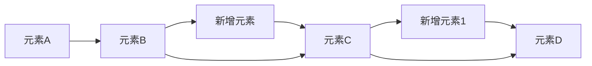


**语法**：:game_die: 

```js
arr.push(元素1, ... ,元素n)
```

-  例如：

```js
<script>
    let arr = ['刘桑','张三','李四']
    let arrPush = arr.push(1,2,3)
    console.log(arr)//['刘桑','张三','李四',1,2,3]
    console.log(arrPush)//返回数组长度为:6
</script>
```

-  <font style="color:red">arr.unshift(新增的内容)</font>.

   -  方法将一个或多个元素添加到数组的**开头**，并返回改数组的新长度

   ###### 图解::part_alternation_mark: 

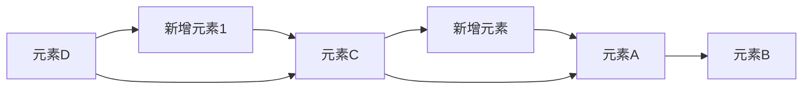


**语法**：:game_die: 

```js
arr.unshift(元素1, ... ,元素n)
```

-  例如:

```js
<script>
    let arr = ['刘桑','张三','李四']
    let arrPush = arr.unshift(1,2,3)
    console.log(arr)//[1,2,3,'刘桑','张三','李四']
    console.log(arrPush)//返回数组长度为:6
</script>
```

###### 删除数组中的0:star: 

**方式一**: splice:dizzy: 

```js
<script>
  let arr = [2,0,6,1,77,0,52,0,25,7]
  //遍历数组
  for(let i = 0,end = arr.length;i < end;i ++){
      //判断元素是否为0
      if(arr[i] === 0){
          //如果为0则通过当前元素的下标删除这个元素
          //i:下标,1:删除一个元素
          arr.splice(i,1)
      }
  }
  console.log(arr)
</script>
```

**方式二**: 创建新数组并拷贝进去不包含0的元素:dizzy: 

```js
<script>
  let arr = [2,0,6,1,77,0,52,0,25,7]
  //实例新数组用于存储不包含0的元素
  let  newArr = []
  //遍历数组
  for(let i in arr){
      //判断数组元素是否为0
      if(arr[i] === 0){
          //如果为0则终止本次循环，执行下次循环
        continue    
      }
      //将不是0的元素依次push到新数组的末尾
      newArr.push(arr[i])
  }
  console.log(newArr)
</script>
```

## 数组操作-删除:deciduous_tree: 

:diamond_shape_with_a_dot_inside: 

<font style="color:red">**数组.pop()**</font>方法从数组中删除最后一个元素,并返回该元素的值,一次只能删除一个元素

###### 图解::part_alternation_mark: 

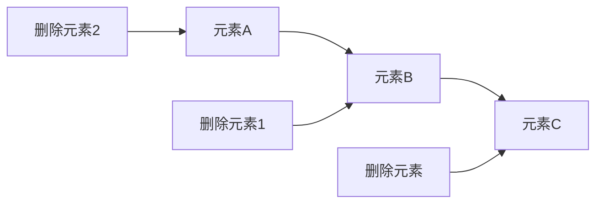

-  **语法**::game_die: 

```js
arr.pop()
```

-  **例如**:

```js
<script>
  let arr = ['刘桑','李四','张三']
  //删除数组中最后的元素,并返回值
  let arrPop = arr.pop()
  console.log(arr)//['刘桑','李四']
  console.log(arr)//张三
</script>
```

:diamond_shape_with_a_dot_inside: 

<font style="color:red">**shift( )**</font>方法从数组中删除开头一个元素,并返回该元素的值,一次只能删除一个元素

###### 图解::part_alternation_mark: 

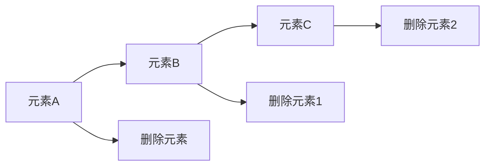

-  **语法**::game_die: 

```js
arr.shift()
```

-  **例如**:


```js
<script>
    let arr = ['刘桑','李四','张三']
    //删除数组中开头的元素,并返回值
    let arrShift = arr.shift()
    console.log(arr)
    console.log(arrShift)
</script>
```

:diamond_shape_with_a_dot_inside: 

<font style="color:red">**splice( )**</font>方法通过元素的下标删除指定的元素

-  **语法**::game_die: 

```js
arr.splice(start,deleteCount)
arr.splice(起始位置,删除几个元素)
```

**解释**:

-  <font style="color:red">start起始位置</font>.
   -  指定修改的开始位置(从0计数)
-  <font style="color:red">deleteCount:</font>.
   -  表示要移除的数组元素的个数
   -  可选的，如果省略则==默认从指定的起始位置删除到最后==。

###### 图解::part_alternation_mark: 

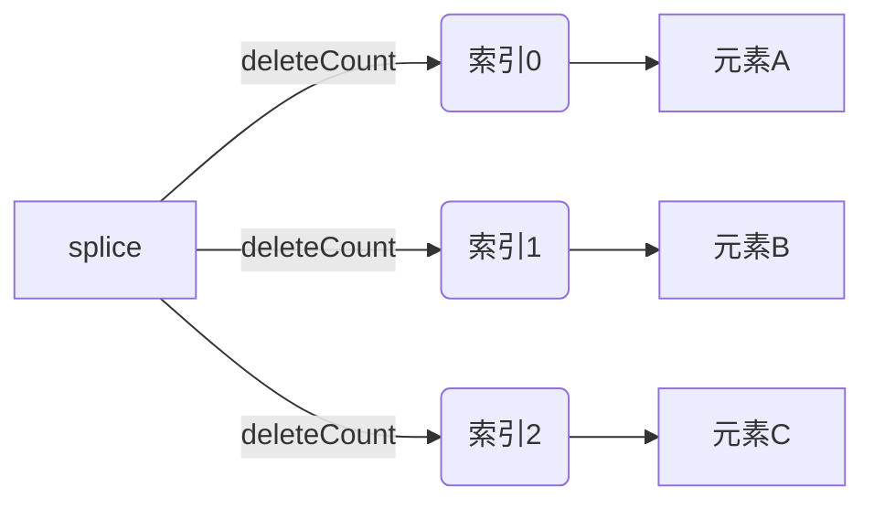

```js
<script>
  let arr = ['刘桑','张三','李四']
  //指定元素下标和删除几个元素
  arr.splice(1,1)
  console.log(arr)//[ "刘桑", "李四" ]
  let arr1 = ['刘桑','张三','李四']
  //指定元素下标但不指定删除几个元素默认删除到最后
  arr1.splice(1)
  console.log(arr1)//[ "刘桑" ]
</script>
```

## 案例—根据数据生成柱形图:deciduous_tree: 

:diamond_shape_with_a_dot_inside: 

**需求**：用户输入四个季度的数据，可以生成柱形图

**分析**：

1.  需要输入3次，所以可以把3个数据放到一个数组里面
    -  利用循环，弹出3次框，同时将数据存储到数组中
2.  遍历该数组，根据数据生成3个柱形图，渲染打印到页面中
    -  柱形图就是div盒子，设置宽度固定，高度是用户输入的数据
    -  div里面包含显示的数字和第n季度

```js
<!DOCTYPE html>
<html lang="en">
<head>
    <meta charset="UTF-8">
    <title>Title</title>
    <style>
        #box{
            display:flex;
            width: 700px;
            height: 300px;
            border-left:red 2px solid;
            border-bottom:red 2px solid;
            margin: 50px auto;
            justify-content: space-around;
            align-items: flex-end;
            text-align: center;
        }
        #box>div{
            display: flex;
            width: 50px;
            background-color: pink;
            flex-direction: column;
            justify-content: space-between;
            text-align:center;
        }
        #box div span{
            margin-top: -21px;
        }
        #box div p{
            margin-bottom: -35px;
            width: 70px;
            margin-left: -10px;
        }
    </style>
</head>
<body>
<script>
    let arr = [1,2,3]
    let j = 0;
    for(let i = 0;i < arr.length;i ++){
        arr[i] = +prompt(`请输入第> : ${i+1} <个季度的值:👇`)
        if(i === arr.length - 1) {
            let num = +prompt(`是否还要继续输入数据 现在是第${i+1}个 , [1.继续 2.不了不了]`)
            if(num === 1){
                arr.push(0)
            }else{
                break
            }
        }
    }
    document.write(`<div id="box">`)
    for(let i = 0;i < arr.length;i ++){
        document.write(`
            <div style="height:${arr[i]}px">
                <span>${arr[i]}</span>
                <p>第${(i+1)}季度</p>
            </div>
        `)
    }
    document.write(`</div>`)
</script>
</body>
</html>
```

效果：


## 案例—冒泡排序算法:deciduous_tree: 

:diamond_shape_with_a_dot_inside: 

冒泡排序

-  冒泡排序是一种简单的排序算法
-  它重复地走访过要排序的数列，一次比较两个元素，如果它们顺序错误就把它们交换过来，走访数列的工作是重复的进行直到没有再需要交换，也就是说该数列已经排序完成
-  这个算法的名字由来是因为越小的元素会经由交换慢慢，"浮"，到数列的顶端
-  比如数组[2,3,1,4,5]经过排序成为了[1,2,3,4,5]或者[5,4,3,2,1]

找规律：:game_die: 

1.  一共需要的趟数，我们用外层for循环

>  5个数据我们一共需要走4趟
>  长度就是 数组长度 减去1 arr.length - 1

2.  每一趟交换次数，我们用里层for循环

>  第一趟 交换 4 次
>
>  第二趟 交换 3 次
>
>  第三趟 交换 2 次
>
>  第四趟 交换 1 次
>
>  长度就是 数组长度减去次数
>
>  但是我们次数 是从0次开始的，所以，最终 arr.length - i - 1

3.  交换2个变量

```js
<script>
    let arr = [7,2,8,1,3,6,5,4,9]
    let num
    //外循环
    for(let i = 0,end = arr.length - 1;i < end;i ++){
        //内循环,每次循环数组长度-i-1就能达到如下的执行规律
        /*
        * 外循环，循环9次
        * 内循环
        * 9 - 0 - 1 = 8
        * 9 - 1 - 1 = 7
        * 9 - 2 - 1 = 6
        * 9 - 3 - 1 = 5
        * 9 - 4 - 1 = 4
        * 9 - 5 - 1 = 3
        * 9 - 6 - 1 = 2
        * 9 - 7 - 1 = 1
        * 9 - 8 - 1 = 0
        * */
        for(let j = 0;j < arr.length - i - 1;j ++){
            //判断前一个元素是否小于后一个元素
            if(arr[j + 1] < arr[j]){
                //对数组的元素进行交换位置
                num = arr[j + 1]
                arr[j + 1] = arr[j]
                arr[j] = num
            }
        }
    }
    console.log(arr)
</script>
```

## 数组排序简化版—sort:deciduous_tree: 

:diamond_shape_with_a_dot_inside: 

<font style="color:red">**数组.sort()**方法可以排序</font>.

**语法**：:game_die: 

**升序排序写法**.:dizzy: 

```js
let arr = []
arr.sort(function(a,b){
   return a - b
})
```

**降序排序写法**.:dizzy: 

```js
let arr = []
arr.sort(function(a,b){
   return b - a
})
```

## 数组中map方法 迭代数组

-  使用场景：

map可以遍历数组==处理数据==，并且==返回新的数组==。

```js
const arr = ['red','blue','green']
const newArr = arr.map(function(ele,index) {
   console.log(ele)//数组元素
   console.log(index)//数组索引号
   return ele + '颜色' //遍历返回 新的元素 组成新的 数组
})
console.log(newArr) //['red颜色','blue颜色','green颜色']
```

==map也称为映射==。映射是个术语，指两个元素的集之间元素相互 "对应" 的关系。

==map重点在于有返回值==，forEach没有返回值

**上面代码的返回结果**：


-  <font title=red>**注意**</font>：不要使用map来单纯的遍历数组这样就违背了map的设计初衷了，它是用来遍历一个数组经过一些处理返回一个新数组来使用。

## 数组中join方法

-  **作用**：

join() 方法用于把数组中的所有元素==转换一个字符串==。

-  **语法**：

```js
const arr = ['red','blue','green']
console.log(arr.join('')) //redbluegreen
console.log(arr.join()) //red,blue,green
```

-  **参数**：

数组==元素==是==通过参数里面指定的分隔符==进行==分隔==的，==空字符串('')==，则所有元素之间都==没有任何字符来分隔==。

参数为空默认使用==逗号隔开==。

# 函数:christmas_tree:

:diamond_shape_with_a_dot_inside: 

**函数**:

function,是被设计为<font style="color:red">**执行特定任务**</font>的代码块

**为什么需要函数？**。

说明::clipboard: 

函数可以把具有相同或相似逻辑的代码"包裹"起来，通过函数调用执行这些被"包裹"的代码逻辑，这么做的优势是利于<font style="color:red">**精简代码方便复用**</font>.

比如我们前面使用的alter(),prompt()和console.log()都是一些**js函数**，只不过已经封装好了，我们直接使用的。

**函数使用**.

-  函数的声明语法:game_die: 

```js
function 函数名(){
   函数体
}
```

-  例如:

```js
function sayHi(){
   document.write('hai~~~')
}
```

-  **函数名 命名规范**.:stars:.
   -  和变量命名基本一致
   -  尽量小驼峰式命名法
   -  前缀应该为动词
   -  命名建议：常用动词约定

| 动词 | 含义                   |
| ---- | ---------------------- |
| can  | 判断是否可执行某个动作 |
| has  | 判断是否含义某个值     |
| is   | 判断是否为某个值       |
| get  | 获取某个值             |
| set  | 设置某个值             |
| load | 加载某些数据           |

## 函数调用语法::game_die: 

:diamond_shape_with_a_dot_inside: 

```js
//函数调用，这些函数体内的代码逻辑会被执行
函数名()
```

:warning:**注意**：声明(定义)的函数必须调用才会真正被执行，使用()调用函数

-  **例如**：:star2: 

```js
//函数一次声明可以多次调用，每一次函数调用函数体里面的代码会重新执行一次
sayHi()//执行函数的第一次
sayHi()//执行函数的第二次
```

-  **演示**：

```js
<script>
    //声明函数
    function sayHi(){
        document.write('hi~~~<br>')
    }
    //调用多次函数
    for(let i = 0;i < 3;i ++){
        sayHi()
    }
</script>
```


-  我们曾经使用的alert(),parseInt()这种名字后面跟小括号的本质都是函数的调用

## 函数体.:deciduous_tree: 

:diamond_shape_with_a_dot_inside: 

>  函数体是函数的构成部分，它负责将相同或相似代码**"包裹"**起来，直到函数调用时函数体内的代码才会被执行,函数的功能代码都要写在函数体当中。

```js
<script>
    let num = +prompt('请输入数值:')
    let num1 = +prompt('请输入数值:')
    function subNumber(a,b){
        return a + b
    }
    alert(`相加后的结果为:${subNumber(num,num1)}`)
</script>
```

```js
<script>
    let n = +prompt('请输入要求从0开始的累加和的数值:')
    //声明有参方法,接收一个参数
    function run(a){
        //记录累加和的变量
        let num = 0
        //循环用户输入的数值
        for(let i = 0;i < a;i ++){
            //进行累加和
            num += (i+1)
        }
        alert(num)
    }
    //调用方法并传入参数
    run(n)
</script>
```

## 函数传参:deciduous_tree: 

:diamond_shape_with_a_dot_inside: 

与Java不同JavaScript方法中参数列表不需要声明参数的数据类型比如Java中这么写run(String name,int age)而JavaScript中这么写run(a,b)即可

若函数完成功能需要调用者传入数据，那么就需要拥有参数的函数,比如

```js
function run(a = 0,b = 0){
   return a + b
}
run(1,2)//result : 3
```

<font style="color:red">这样可以极大提高函数的灵活性</font>.

**声明语法**：:game_die: 

```js
function 函数名(参数列表){
   函数体
}
函数名(传入参数)
```

### 参数列表:deciduous_tree: 

-  传入参数列表
-  声明这个函数需要传入几个数据
-  多个数据用逗号隔开

```js
function 函数名(参数1,参数2){
   函数体
}
```

-  调用语法：

```js
函数名(传递的参数列表)
```

-  例如:

```js
//调用方法传入参数
getSquare(8)
```

```js
//调用方法传入参数,多个参数使用逗号隔开
getSum(10,20)
```

-  调用函数时，需要传入几个数据就写几个，用逗号隔开

### 实参和形参:deciduous_tree: 

:diamond_shape_with_a_dot_inside: 

**形参**：声明函数时写在函数名右边小括号里的叫形参(形式上的参数):dizzy:.

```js
run(1,2)//实参
```

**实参**：调用函数时写在函数名右边小括号里的叫实参(实际上的参数):dizzy:.

```js
function run(a = 0,b = 0){//形参,其作用域在这个函数体内,外部不能访问到
   函数体
}
```

:clipboard: 

-  <font style="color:red">形参可以理解为是</font>在这个函数内声明的<font style="color:red">变量(比如 num1 = 10)</font>实参可以理解为是给这个变量赋值
-  <font style="color:red">开发中尽量保持形参和实参个数一致否则报错</font>.

```js
<script>
    //用户键盘输入
    let num = +prompt('请输入第一个数值:')
    let num1 = +prompt('请输入第二个数值:')
    //调用方法并传入两个参数
    //实参
    run(num,num1)
    //有参方法接收两个参数，形参
    function run(num,num1){
        alert(`两数相加的结果为:${num + num1}`)
    }
</script>
```

### 函数传参—参数默认值:deciduous_tree: 

:diamond_shape_with_a_dot_inside: 

**形参**：可以看作变量，但是如果一个变量不给值，默认是 `undefined`.

undefined:

如果用户不输入实参，如下的案例，则出现undefined + undefined结果是NaN

```js
<script>
    //不传递实参
    run()
    //形参为undefined 
    function run(a,b){
        alert(`计算结果:${a + b}`)//NaN
    }
</script>
```

NaN

我们可以改进下，用户不输入实参，可以给<font style="color:red">**形参默认值**</font>，可以默认为0或者使用 逻辑中断，这样程序更严谨，如下操作：

```js
<script>
    //不传递实参
    run()
    //形参为0,0 避免undefined + undefined = NaN的情况
    function run(a = 0,b = 0){
        //或者使用如下操作
        /* 非0即为真！
        a = a || 0
        b = b || 0
        */
        alert(`计算结果:${a + b}`)//0
    }
</script>
```

:stars: <font style="color:red">**说明**：这个默认值只会在缺少实参参数传递时，才会被执行，所以有参数会优先执行传递过来的实参，否则默认为我们指定的默认值或者undefined</font>.

**形参数组防止undefined**.:star2: 

```js
<script>
    let arr = [90,80,70]
    getSum(arr)
    getSum()
    //为arr形参初始空数组防止undefined调用Length报错
    function getSum(arr = []){
        let num = 0
        //                  undefined没有length会报错
        for(let i = 0,end = arr.length;i < end;i ++){
            num += arr[i]
        }
        console.log(num)
    }
</script>
```

## 函数返回值:deciduous_tree: 

:diamond_shape_with_a_dot_inside: 

**提问:grey_question:**：什么是函数?

:clipboard: 函数是被设计为<font style="color:red">执行特定任务</font>的代码块

**提问:grey_question:**：执行完特定任务之后，然后呢？

把任务的结果给我们

```js
<script>
    run(1,2)
    function run(a = 0,b = 0){
        document.write(a + b)
    }
</script>
```

-  :warning:**缺点**：把计算后的结果处理方式写死了，内部处理了

-  :star2:**解决**：把处理结果返回给调用者

**有返回值函数的概念**：:green_book: 

-  当调用某个函数，这个函数会返回一个结果出来
-  这就是有<font style="color:red">返回值</font>的函数

:dizzy:当函数需要返回数据出去时，用**return**关键字

**语法**：

```js
return 数据
```

-  **细节**：:stars: 

   -  在函数体中使用return关键字能将内部的执行结果交给函数外部使用
   -  return后面代码不会再被执行，会立即结束当前函数，所以<font style="color:red">**return后面的数据不要换行写**</font>.

   ```js
   <script>
       run(1,2)
       function run(a = 0,b = 0){
           return a + b
           /*return 换行写会返回undefined
             a + b*/
           //unreachable code after return statement
           //翻译:返回语句后无法访问的代码
           console.log('我被执行了吗?')
       }
   </script>
   ```

   -  return函数可以没有return,这种情况函数默认返回值为undefined

```js
<script>
    let n = run(1,2)
    console.log(n)//undefined
    function run(a = 0,b = 0){
        return//undefined
    }
</script>
```

:clipboard:**总结**：

1.  为什么要让函数有返回值？
    -  函数执行后得到结果，结果是调用者想要拿到的(一句话，函数内部不需要输出结果，而是<font style="color:red">返回结果</font>)
    -  对执行结果的扩展性更高，可以让其它的程序使用这个结果

## arguments的使用:deciduous_tree: 

当我们不确定有多少个参数传递的时候，可以用`arguments`来获取。在JavaScript中，arguments实际上它是当前函数的一个<font style="color:red">内置对象</font>。所有函数都内置了一个arguments对象，arguments对象中<font style="color:red">存储了传递的所有实参</font>。

<strong style="color:red">注意</strong>：只有函数才有arguments对象，每个函数都内置好了arguments对象。

通过代码：

```js
function fu() {
   // arguments里面存储了所有传递过来的实参
   console.log(arguments);
}
fu(1,2,3);
//-----------------结果--------------------.
Arguments(3)
0: 1
1: 2
2: 3
callee: ƒ fu()length: 3
Symbol(Symbol.iterator): ƒ values()
[[Prototype]]: Object
```

看得出：<strong style="color:red">arguments展示形式是一个伪数组</strong>^并不是真正意义上的数组^，因此可以进行遍历。伪数组具有以下特点：

-  具有length属性
-  按索引方式存储数据
-  不具有数组的push，pop等方法

代码演示：

```js
<script>
    function fu() {
        // arguments里面存储了所有传递过来的实参
        console.log(arguments);
        console.log(arguments.length);
        console.log(arguments[2]);
        for(let i = 0;i < arguments.length;i ++)
            console.log(arguments[i]);
    }
    fu(1,2,3);
    fu(1,2,3,4,5);
    // 伪数组，并不是真正意义上的数组
    // 1.具有数组的length属性
    // 2.按照索引的方式进行存储的
    // 3.它没有真正数组的一些方法 push() pop()等
</script>
--------------------------result--------------------------
Arguments(3) [1, 2, 3, callee: ƒ, Symbol(Symbol.iterator): ƒ]
3
3
1
2
3
Arguments(5) [1, 2, 3, 4, 5, callee: ƒ, Symbol(Symbol.iterator): ƒ]
5
3
1
2
3
4
5
>
```

## 调用有参函数带返回值返回数组的最大值和最小值:deciduous_tree: 

:diamond_shape_with_a_dot_inside: 

```js
<script>
    //使用三元运算符获取最大值
    console.log(sum(13,11))
    function sum(a = 0,b = 0){
        return a > b ? a : b
    }

    let  arr = [11,10,5,15,8,9,12]
    let num = arrSum(arr)
    console.log(`最大值:${num[0]}`)
    console.log(`最小值:${num[1]}`)
    function arrSum(arr = []){
        let max = arr[0]
        let min = arr[0]
        for(let i = 0,end = arr.length;i < end;i ++){
            //判断拿最大值
            if(arr[i] > max){
                max = arr[i]
            }
            //判断拿最小值
            if(arr[i] < min){
                min = arr[i]
            }
        }
        //返回一个数组,返回最大值和最小值
        return [max,min]
    }
</script>
```

## 函数细节补充:palm_tree: 

:diamond_shape_with_a_dot_inside: 

两个相同的函数后面的会覆盖前面的函数

```js
<script>
    run()//2
    function run(){
        console.log('1')
    }
    function run(){
        console.log('2')
    }
    run()//2
</script>
```

在JavaScript中,实参的个数和形参的个数可以不一致

-  如果形参过多会自动填上undefined(解决办法就是**run(a = 0,b = 0)**)(了解即可)
-  如果实参过多那么多余的实参会被忽略(函数内部有一个arguments,里面装着所有的实参)

```js
<script>
    //a:1 , b:2
    function run(a = 0,b = 0){
        //1+2 = 3
        console.log(a + b)//3
    }
    //1找了a,2找了b,3一直找不到另一半
    run(1,2,3)
</script>
//-------------------------------------
<script>
    //a:1 , b:undefined
    function run(a = 0,b = 0){
        //a:1          b:0
        //1+0 = 1
        console.log(a + b)//1
    }
    //1找了a
    run(1)
</script>
```

函数一旦碰到return就不会在往下执行了,函数的结束用return

## 作用域:deciduous_tree: 

:diamond_shape_with_a_dot_inside: 

通常来说，一段程序代码中所用到的名字并不总是有效和可用的，而限定这个名字的<font style="color:red">可用性的代码范围</font>就是这个名字的<font style="color:red">作用域</font>.

:stars: 作用域的使用提高了程序逻辑的局部性，增强了程序的可靠性，减少了名字冲突

:dizzy: 

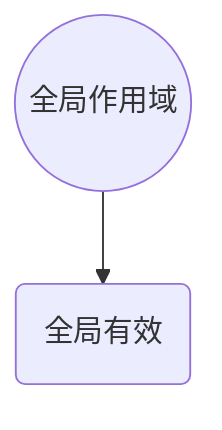

作用于所有代码执行的环境(整个script标签内部)或者一个独立的js文件

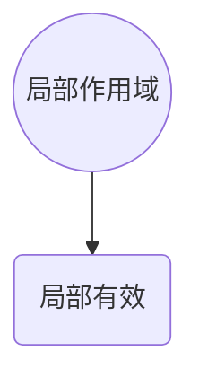

作用于**函数内的代码环境**,就是局部作用域,因为跟函数有关系,所以也称为**函数作用域**.

:clipboard:**在JavaScript中，根据作用域的不同，变量可以分为**:

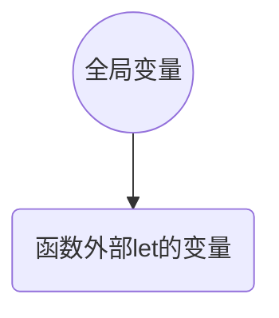

**全局变量**: 在任何区域都可以访问和修改


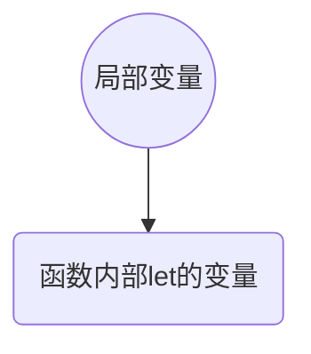

**局部变量**: 只能在当前函数内部访问和修改

```js
<script>//全局作用域
    //全局变量
    let num = 0
    function run(){
        console.log(num)//0
    }
    run()

    function methodSum(){//局部作用域
        //局部变量,只能在methodSum方法作用域中使用
        let num1 = 0
        console.log(num1)//0
    }
    methodSum()
    //console.log(num1)//Uncaught ReferenceError: num1 is not defined
</script>
```

:warning:变量有一个坑，特殊情况：

:red_circle:如果函数内部，变量没有声明，直接赋值，也当<font style="color:red">全局变量看</font>，但是<span alt="wavy" style="color:red">**强烈不推荐**</span>.

:clipboard:形参可以看作是函数的局部变量

 ```js
 <script>
     function run(){
         num = 10//当全局变量来看，强烈 强烈 强烈不推荐
     }
     run()
     console.log(num)
 
     function run1(a = 0,b = 0){
        //a和b为局部变量,外部访问不到
         console.log(a+b)
     }
     run1()
     console.log(a)//Uncaught ReferenceError: a is not defined
 </script>
 ```


## 变量的访问原则:deciduous_tree: 

:diamond_shape_with_a_dot_inside: 

只要是代码，就至少有一个作用域

写在函数内部的局部作用域

如果函数中还有函数，那么在这个作用域中就又可以诞生一个作用域

**访问原则**：<font style="color:red">在能够访问到的情况下，**先局部**，局部没有再找**全局**</font>.


:dizzy:**作用域链**：采取<font style="color:red">**就近原则**</font>的方式来查找变量最终的值

## 匿名函数:deciduous_tree: 

:diamond_shape_with_a_dot_inside: 

**函数可以分为**：具名函数 ， 匿名函数

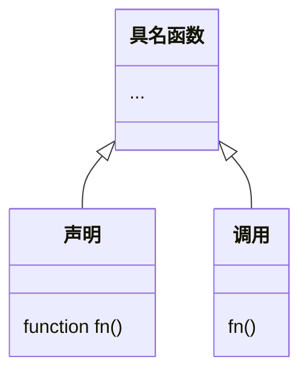

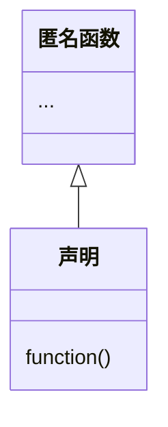

**没有名字的函数，无法直接使用**.

:dizzy:**使用方式**：

-  <span alt="shake">**函数表达式**</span>.

   -  将匿名函数赋值给一个变量，并且通过变量名称进行调用，我们将这个称为<font style="color:red">函数表达式</font>.
   -  **语法**：:game_die: 

   ```js
   let fn = function () {
      函数体
   }
   ```

   -  **调用**：:video_game: 

   ```js
   fn()//函数名()
   ```

   其中函数的形参和实参使用跟具名函数一致


-  <span alt="shake">**传递参数**</span>:space_invader: 


```js
<script>
    let fn = function (x = 0,y = 0) {
        //函数表达式
        console.log(x + y)
    }
    console.log(fn)//function fn(x,y)
    fn(10,10)
</script>
```

-  :warning:<span alt="wavy" style="color:red">函数表达式 ，必须先声明函数表达式，后调用 和 声明的变量一样否则找不到</span>.


```js
<script>
    console.log(num)//Uncaught ReferenceError:
    // can't access lexical declaration 'fn'
    // before initialization
    let num = 10;
    console.log(fn)//Uncaught ReferenceError:
    // can't access lexical declaration 'fn'
    // before initialization
    let fn = function () {
        //函数表达式
    }
    console.log(fn1)//function fn1()
    function fn1 () {
    }
</script>
```

-  :warning:**注意**:
   -  具名表达式可以写在任意位置
-  -  函数表达式必须先声明后调用

### 立即执行函数:dart: 

:diamond_shape_with_a_dot_inside: 

-  **场景介绍**: <font title="red">避免全局变量之间的污染</font>.

-  **语法**: :game_die: 

```js
//方式1   形参                 实参,调用函数
(function () {console.log(11)})();
//方式2   形参	               实参,调用函数
(function () {console.log(11)}());
!function(){}()
+function(){}()
~function(){}()
```

-  不需要调用 立即执行:dizzy: 
-  最后一个小括号相当于本质的调用函数，也就是<font style="color:red">实参</font>.

```js
<!DOCTYPE html>
<html lang="en">
<head>
    <meta charset="UTF-8">
    <title>Title</title>
    <style>
        #bu{
            width: 100px;
            height: 260px;
            font-size: 50px;
        }
    </style>
</head>
<body>
<button id="bu">点击我</button>
<script>
    let btn = document.querySelector('button')
    btn.onclick = function(){
        alert('弹出')
    }
</script>
</body>
</html>
```

:warning:**注意**：<font style="color:red">多个立即执行函数要用`;`隔开，不然会报错</font>.

```js
<script>
    //          接收形参
    ;(function (a = 0,b = 0) {
        console.log(a + b)
    })(1,2)//最后的小括号是调用函数,传入实参
    //多个立即执行函数需要使用分号结束但是分号可以写在前面
    ;(function () {
        let num = 10
        console.log(num)
    })()
</script>
```

-  :warning:如果不加分号来结束则会报错: <font style="color:red">Uncaught TypeError: (intermediate value)(...) is not a function</font>.

## 案例—转换时间:stars: 

:diamond_shape_with_a_dot_inside: 

需求：用户输入秒数，可以自动转换为,时,分,秒

分析：:game_die: 

1.  用户输入总秒数(注意默认值)
2.  计算 时,分,秒(封装函数) 里面包含数字补0
3.  打印

**计算公式**: 计算时分秒

小时：h = parseInt(总秒数/60/60%24)

分钟：m = parseInt(总秒数/60%60)

秒数：s = parseInt(总秒数%60)

最终样式:


```js
<script>
    ;(function(){
        let date = +prompt('请输入一个时间戳:')
        function sayDate(t){
            let h = parseInt(t/60/60%24)
            let s = parseInt(t/60%60)
            let m = parseInt(t%60)
            h = h < 10 ? '0' + h : h
            s = s < 10 ? '0' + s : s
            m = m < 10 ? '0' + m : m
            return `${h}时,${s}分,${m}秒`
        }
        document.write(sayDate(date))
    })()
</script>
```

# 转换为Boolean类型:christmas_tree: 

:diamond_shape_with_a_dot_inside: 

:dizzy:在Java中布尔值要么是true，要么是false，不能被其它的数据定义，逻辑判断必须返回的是一个布尔类型的值不能`false||0`这种操作.

**显示转换**：

1.  **Boolean**(内容)

<font  style="color:red">记忆：' '   <span alt="blink">**非空串即为真**</span>,  0  <span alt="blink">**非0即为真**</span>,  undefined,null,false,NaN转换为布尔值后都是false,其余则为true</font>.

```js
<script>
    //结果全为假,其余都为真
    console.log(Boolean(''))
    console.log(Boolean(0))
    console.log(Boolean(undefined))
    console.log(Boolean(null))
    console.log(Boolean(NaN))
</script>
```

```js
console.log(false && 20)//false
console.log(5 < 3 && 20)//false
console.log(undefined && 20)//undefined
console.log(null && 20)//null
console.log(0 && 20)//0
console.log(10 && 20)//20
```

```js
console.log(false || 20)//20
console.log(5 < 3 || 20)//20
console.log(undefined || 20)//20
console.log(null || 20)//20
console.log(0 || 20)//20
console.log(10 || 20)//10
```


# <span alt="shake">对象</span>:christmas_tree: 

:diamond_shape_with_a_dot_inside: 

**什么是对象**.

0.  对象(Object): JavaScript里的一种数据类型

1.  可以理解为是一种无序的数据集合,注意数组是有序的数据集合

2.  用来描述某个事物,例如描述一个人

    -  人有姓名,年龄,性别等信息,还有吃饭睡觉敲代码等功能
    
    -  如果有多个变量保存则比较散,用对象比较统一
    
    ```js
    let obj = {
       uname: '刘桑',
       age: 18,
       gender: '男'
    }
    ```
    
    

:stars:**对象有什么特点**?

   1.  无序的数据的集合
   2.  可以详细的描述某个事物

## 1.**对象声明语法**:game_die: 

:diamond_shape_with_a_dot_inside: 

**声明方式**:

第一种:

```js
let 对象名 = {}
```

第二种:

```js
let 对象名 = new Object()
```

**例如**:

```js
//声明了一个person的对象
let person = {}
```

-  实际开发中,我们多用花括号.<font title="red">{ }是对象字面量</font>.

## 2.**对象有属性和方法组成**:space_invader: 

:diamond_shape_with_a_dot_inside: 

-  属性: 信息或叫特征(名词).比如 手机尺寸,颜色,重量等...
-  方法: 功能或叫行为(动词).比如 手机打电话,发短信,玩游戏...

```js
let 对象名 = {
   属性名: 属性值,
   方法名: 方法()
}
```

## 3.**属性**:dart: 

:diamond_shape_with_a_dot_inside: 

数据描述性的信息称为属性,如人的姓名,身高,年龄,性别等,一般是名词性的

```js
let obj = {
   uname: '刘桑',
   age: 18,
   gender: '女'
}
```

-  属性都是成对出现的,包括属性名和值,他们之间使用英文<span alt="blink">`:`</span> 分隔

-  多个属性之间使用英文<span alt="blink">`,`</span>分隔
-  属性就是依附在对象上的变量(外面是变量,对象内是属性)
-  属性名可以使用" "或' ',<font title="red">一般情况下省略</font>,除非名称遇到特殊符号如<span alt="wavy">空格,中横线</span>等

```js
<script>
    // 声明对象
    let obj = {
        uname: '刘桑',
        age: 18,
        gender: '女'
    }
    console.log(obj)//Object { uname: "刘桑", age: 18, gender: "女" }
</script>
```

## 4.**对象使用**:black_joker: 

:diamond_shape_with_a_dot_inside: 

-  对象本质是无序的数据集合，操作数据无非就是<font title="red"><span alt="blink">增</span></font>,<font title="red"><span alt="blink">删</span></font>,<font title="red"><span alt="blink">改</span></font>,<font title="red"><span alt="blink">查</span></font> 语法:


### 属性-查:sailboat: 

声明对象，并添加了若干属性后，可以使用<span alt="blink">`.`</span>获得对象中属性对应的值，称之为属性访问。

**语法**：<font title="red">对象名</font><span alt="blink">`.`</span><font title="blue">属性名</font> 

简单理解就是获得对象里面的属性值

```js
// 声明对象
let obj = {
   uname: '刘桑',
   age: 18,
   gender: '女'
}
//使用 对象名.属性名 的方式来获取对象的信息
console.log(obj.uname)//刘桑
console.log(obj.age)//18
console.log(obj.gender)//女
```

### 属性-改:gear: 

**语法**：<font title="red">对象名</font><span alt="blink">`.`</span><font title="blue">属性名</font> <span alt="blink">`=`</span> <span alt="shake">新值</span>.

```js
// 声明对象
let obj = {
   uname: '刘桑',
   age: 18,
   gender: '女'
}
//使用 对象名.属性名 的方式来获取对象的信息
console.log(obj.uname)//刘桑
console.log(obj.age)//18
console.log(obj.gender)//女
// 修改对象的属性值
obj.age = 20
obj.gender = '男'
console.log(obj.uname)//刘桑
console.log(obj.age)//20
console.log(obj.gender)//男
```

### 属性-增:zap: 

**语法**：<font title="red">对象名</font><span alt="blink">`.`</span><font title="blue">属性名</font> <span alt="blink">`=`</span> <span alt="shake">新值</span>.

-  如果对象中存在属性则为 <span alt="shake">改</span>，如果属性不存在则为 <span alt="shake">增</span> .

```js
let obj = {
   uname: '刘桑',
   age: 18,
   gender: '女'
}
obj.hobby = '敲代码'
console.log(obj)//Object { uname: "刘桑", age: 18, gender: "女", hobby: "敲代码" }
```

### 属性-删(了解):dango: 

**语法**：<span alt="shake">`delete`</span> <font title="red">对象名</font><span alt="blink">`.`</span><font title="blue">属性名</font> 

<span alt="wavy"><font style="color:red">在严格模式下这种操作是不允许的所以作为了解即可</font></span>.

```js
let obj = {
   uname: '刘桑',
   age: 18,
   gender: '女'
}
delete obj.gender
console.log(obj)//Object { uname: "刘桑", age: 18 }
```

### 属性-查的另外一种写法<span alt="shake">:video_game: </span>.

<font style="color:red">对于多次属性或加-等属性，点操作就不能用了</font>。

我们可以采取：<font title="red">**对象['属性']**</font> 方式，<span alt="wavy">单引号</span>和<span alt="wavy">双引号</span>都可以 

```js
let obj = {
   'user-name': '刘桑',
   age: 18,
   gender: '女'
}
// 这种方式会被解析为user 减去 name 结果: NaN
console.log(obj.user-name)//NaN
console.log(obj['user-name'])//刘桑
```

总结：

1.  对象访问属性有哪两种方式？
    -  点形式 <font title="red">对象名</font><span alt="blink">`.`</span><font title="blue">属性名</font> 
    -  [ ]形式 <font title="red">**对象['属性']**</font> 
2.  两种方式有什么区别?
    -  点后面的属性名一定不要加引号
    -  [ ]里面的属性名一定加引号
    -  后期不同使用场景会用到不同的写法

## 5.对象中的方法:christmas_tree: 

:diamond_shape_with_a_dot_inside: 

数据行为性的信息称为方法，如跑步，唱歌等，一般是动词性的，其本质是函数。

```js
let person = {
   name: 'andy',
   sayHi: function(){
      document.write('hi~~~')
   }
}
```

1.  方法是由方法名和函数两部分构成，它们之间使用：分隔
2.  多个属性之间使用英文，分隔
3.  方法是依附在对象中的函数
4.  方法名可以使用 ""或'',一般情况下省略，除非名称遇到特殊符号如空格，中横线等。

```js
let name = prompt('请输入名称:')
let person = {
   name: '刘桑',
   sayHi: function(name = ''){
      document.write(`我的名字是:${name}<br>`)//我的名字是:张三
      document.write(`它的名字是:${person['name']}`)//它的名字是:刘桑
   },
   sayNo: function(){
      document.write('哈喽,哈喽')
   }
}
person.sayHi(name)
document.write('<br>')
person.sayNo()
```

-  声明对象，并添加了若干方法后，可以使用`.`调用对象中函数，称之为方法调用。
-  也可以添加形参和实参
-  <font title="red">注意: 千万别忘了给方法名后面加小括号</font> 

## 6.遍历对象:dart: 

:diamond_shape_with_a_dot_inside: 

for遍历对象的问题：

1.  对象里面是无序的键值对，没有规律，不像数组里面有规律的下标
2.  对象没有像数组一样的length属性，所以无法确定长度

```js
let arr = ['pink','blue','red']
for(let item in obj){
   console.log(item)//0 1 2 数组的下标 索引号 但是是字符串类型的'0' '1' '2'
}
```

-  <font style="color:red">不推荐使用for in 来遍历数组</font>.
-  <font style="color:green">但是适合用于遍历对象，对象不能使用for来遍历因为不知道它的长度没有length方法</font>.

```js
// 声明对象
let obj = {
   name: '刘桑',
   age: 18,
   gender: '男'
}
// 使用for in 遍历对象
for(let item in obj){
   // console.log(item)//'name','age','gender'
   //遍历出对象的属性名，以第二种方式来将对象的所有属性信息打印出来,不能使用第一种方式
   console.log(obj[item])//刘桑,18,男
   cnsole.log(obj.item)//undefined，undefined，undefined
   /*
  如果使用console.log(obj.item)来打印的话就相当于是
  console.log(obj.'name')这种写法是报错的,而第二种方式则必须代码引号
  console.log(obj[item])
  			|
  			|相当于
  			v
  console.log(obj['name'])
  */
}
```

-  ==一般不用这种方式遍历数组，主要是用来遍历对象==。
-  for in语法中的item是一个变量，在循环的过程中依次代表对象的属性名
-  由于item是变量名称，所以必须使用[``]语法解析
-  一定记住：<font style="color:red">item</font>是获得对象的<font style="color:red">属性名</font>，<font style="color:red">对象名[item]</font>是获得<font title="red">属性值</font>.

**总结**：

1.  遍历对象用哪个语句？
    -  <font title="red">for in</font>.
2.  遍历对象中，<font style="color:red">for item in obj</font>,获得对象属性是哪个，获得值是哪个？
    -  获得对象属性是<font style="color:red">item</font>.
    -  获得对象值是<font  style="color:red">obj[item]</font>.

## 案例-遍历数组对象:straight_ruler: 

:diamond_shape_with_a_dot_inside: 

思路：

>  先遍历数组，通过下标访问每一个对象然后对每一个对象进行对象的属性的遍历就可以了。

```js
let student = [
   {name:'小明',age:18,gender:'男',hometown:'河北省'},
   {name:'小红',age:19,gender:'女',hometown:'河南省'},
   {name:'小刚',age:17,gender:'男',hometown:'山西省'},
   {name:'小丽',age:18,gender:'女',hometown:'山东省'}
]
// 遍历数组中所有对象
for(let i = 0,end = student.length;i < end;i ++){
   // 定义变量存储遍历的每一个对象
   let obj = student[i]
   // for in变量对象
   for(let k in obj){
      console.log(obj[k])
   }
}
```

## 7.内置对象:sake: 

:diamond_shape_with_a_dot_inside: 

### 内置对象是什么:heart_decoration: 

JavaScript内部提供的对象，包含各种属性和方法给开发者调用

比如说我们之前一直在使用的一些内置对象：

-  document.write( )
-  console.log( )
-  ...

### 内置对象Math:1st_place_medal: 

**介绍**：Math对象是JavaScript提供的一个<font title="red">"数学"对象</font>.

**作用**：提供了一系列做<font title="red">数学运算</font>的方法

**Math对象包含的方法有**：

```js
// 返回算术常量e,即自然对数的底数(约等于2.718).
console.log(Math.E)
// 返回2的自然对数(约等于0.693).
console.log(Math.LN2)
// 返回10的自然对数(约等于2.302).
console.log(Math.LN10)
// 返回以2为低的e的对数(约等于1.4426950408889634).
console.log(Math.LOG2E)
// 返回以10为低的e的对数(约等于0.434).
console.log(Math.LOG10E)
// 返回圆周率
console.log(Math.PI)
// 返回2的平方根的倒数(约等于0.707).
console.log(Math.SQRT1_2)
// 返回2的平方根(约等于1.414).
console.log(Math.SQRT2)
```


| 方法           | 描述                                             |
| -------------- | ------------------------------------------------ |
| abc(x)         | 返回x的绝对值                                    |
| acos(x)        | 返回x的反余弦值                                  |
| asin(x)        | 返回x的反正弦值                                  |
| atan(x)        | 以介于-PI/2于PI/2弧度之间的数值来返回x的反正切值 |
| atan2(x,y)     | 返回x轴到点(x,y)的角度(介于-PI/2于PI/2弧度之间)  |
| ceil(x)        | 对数进行上舍入                                   |
| cos(x)         | 返回数的余弦                                     |
| exp(x)         | 返回E^x^的指数                                   |
| floor(x)       | 对x进行下舍入                                    |
| log(x)         | 返回数的自然对数(低为e)                          |
| max(x,y,z...n) | 返回x,y,z...n中的最高值                          |
| min(x,y,z...n) | 返回x,y,z,...n中的最低值                         |
| pow(x,y)       | 返回x的y次幂值                                   |
| random()       | 返回0~1之间的随机数                              |
| round(x)       | 四舍五入                                         |
| sin(x)         | 返回数的正弦                                     |
| sqrt(x)        | 返回数的平方根                                   |

### 生成任意范围随机数:pager: 

<font title="red">Math.random()</font>随机函数，返回一个0~1之间，并且包括0但不包括1的随机小数[0,1) (左闭右开)

-  如何生成0~10的随机数呢?

```js
console.log(Math.floor(Math.random() * (10 + 1)))
```

-  如何生成5~10的随机数?

```js
console.log(Math.floor(Math.random() * (5 + 1)) + 5)
```

-  如何生成N~M之间的随机数?

```js
console.log(Math.floor(Math.random() * (M - N + 1)) + N
```

```js
//取到 N ~ M 的随机整数
function ran (M,N){
   return Math.floor(Math.random() * (M - N + 1)) + N
}
console.log(ran(4,8))
```

-  如何随机抽取数组中的一个人?

```js
let arr = ['张三','刘桑','李四']//小数乘数组长度3就是0.9999 * 3 = 2.999,随机数范围也就是向下取整后0~2,但是不会包括2
console.log(`${arr[Math.floor(Math.random() * arr.length)]}`)
```

### 案例—猜数字游戏:space_invader: 

:diamond_shape_with_a_dot_inside: 

```js
let ran = Math.floor(Math.random() * (100 + 1))//声明在循环外随机出一个固定数字
console.log(`生成的随机数为:${ran}`)
let flag = true//开关变量,判断是否执行 '次数已经用完了'
let c = 2;//记录剩余次数变量
for(let i = 0;i < 3;i ++){//循环三次，只有三次猜测机会
   let num = +prompt('请输入一个数字:')
   if(ran > num){
      alert(`猜小了,剩余次数:${(c)}`)
      c--
   }else if(num > ran){
      alert(`猜大了,剩余次数:${c}`)
      c--
   }else{
      flag = false//如果猜对了执行改方法体将flag赋值为fase不执行下面的 '次数已经用完了'这句话
      document.write(`猜对了,仅用了${(i + 1)}次`)
      break
   }
}
if(flag){
   alert('次数已经用完了')
}
```

## 随机生成颜色:earth_africa: 

:diamond_shape_with_a_dot_inside: 

需求：该函数接收一个布尔类型参数，表示颜色的格式是十六进制还是rbg格式

1.  如果参数传递的是true或者无参数，则输出一个随机十六进制的颜色
2.  如果参数传递的是false，则输出一个随机rbg的颜色
3.  格式:

```js
function getRandomColor(flag){
   
}
console.log(getRnadomColor(true))//#ffffff
console.log(getRnadomColor(false))//rgb(255,255,255)
```

分析：

提示：16进制颜色格式为：'#ffffff' 其中f可以是任意 0~f之间的字符,需要用到数组

```js
let arr = ['0','1','2','3','4','5','6','7','8','9','a','b','c','d','e','f']
```

提示：rgb颜色格式为：'rbg(255,255,255)' 其中255可以是任意0~255之间的数字

```js
<!DOCTYPE html>
<html lang="en">
<head>
    <meta charset="UTF-8">
    <title>Title</title>
    <style>
        .tu{
            width: 150px;
            height: 150px;
            border-radius: 30%;
        }
    </style>
</head>
<body>
<div class="tu">
</div>
<script>
    // 定义数组存储16进制颜色的每一个字符
    let arr = ['0','1','2','3','4','5','6','7','8','9','a','b','c','d','e','f']
    function getRandomColor(flag){
        // 判断flag执行对应的操作
        if(flag){
            // 声明字符串初始值为#
            let str = '#'
            // 循环6次取6个随机的字符出来
            for(let i = 0;i < 6;i ++){
                // 随机数范围是数组的0~长度
                let num = Math.floor(Math.random() * arr.length)
                // 将随机去除的字符拼接到字符串中
                str += arr[num]
            }
            // 返回字符串
            return str
        }else{
            // 随机出三个0~255之间不同的数字
            let num = Math.floor(Math.random() * (255 + 1))
            let num1 = Math.floor(Math.random() * (255 + 1))
            let num2 = Math.floor(Math.random() * (255 + 1))
            // 返回rbg
            return `rgb(${num},${num1},${num2})`
        }
    }
    document.write(`
       <div class="tu" bgcolor="${getRandomColor(false)}">
       </div>
    `)
</script>
</body>
</html>
```

# 扩展-术语解释:christmas_tree: 

:diamond_shape_with_a_dot_inside: 

知道一些术语,让自己更专业

| 术语   | 解释                                                         | 举例                                      |
| ------ | ------------------------------------------------------------ | ----------------------------------------- |
| 关键字 | 在JavaScript中有特殊意义的词汇                               | let,var,function,if,else,switch,cae,break |
| 保留字 | 在目前的JavaScript中没意义<br>但未来可能会具有特殊意义的词汇 | int,short,long,char                       |
| 标识符 | 变量名,函数名的另一种叫法                                    | 无                                        |
| 表达式 | 能产生值的代码,一般配合运算符出现                            | 10 + 3,age >= 18                          |
| 语句   | 一段可执行的代码                                             | if(  ) for(  )                            |

# 扩展-基本数据类型和引用数据类型:tanabata_tree: 

:diamond_shape_with_a_dot_inside: 

**目标**：了解基本数据类型和引用数据类型的存储方式

简单类型又叫做基本数据类型或者<font title="red">值类型</font>，复杂类型又叫做<font title="red">引用类型</font>.

-  **值类型**：<span alt="blink">**简单数据类型**</span>/<span alt="blink">**基本数据类型**</span>，在存储时变量中存储的是值本身，因此叫值类型
   -  string,number,boolean,undefined,null

-  **引用类型**：<span alt="blink">**复杂数据类型**</span>，在存储时变量中存储的仅仅是地址(<span alt="blink">**引用**</span>)，因此叫做引用数据类型
   -  通过<font title="blue">new</font>关键字创建的对象(系统对象 ，自定义对象)，如Object,Array,Date等

堆栈空间分配区别：

1.  栈(操作系统)：由操作系统自定分配释放存放函数的参数值，局部变量的值等，其操作方式类似于数据结构中的栈；
    -  <font title="red">简单数据类型存放到栈里面</font>.
2.  堆(操作系统)：存储复杂类型(对象)，一般由程序员分配释放，若程序员不释放，由垃圾回收机制回收。
    -  <font title="red">引用数据类型存放到堆里面</font>.

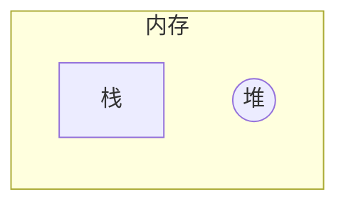

## 1.简单类型的内存分配:package: 

值类型(简单数据类型)：string,number,boolean,undefined,null

值类型变量的数据直接存放在变量(栈空间)中


## 2.复杂类型的内存分配:tea: 

引用类型(复杂数据类型)：通过new关键字创建的对象(系统对象，自定义对象)，如Object,Array,Date等

引用类型变量(栈空间)里存放的是地址，真正的对象是里存放在堆空间中


```js
let num = 10
let num1 = num
num1 = 20
console.log(num)
```


```js
let obj = {
   age: 18
}
let obj1 = obj
obj1.age = 20
console.log(obj)
```


